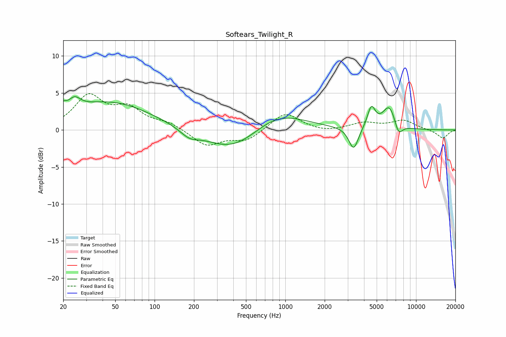

# Softears_Twilight_R
See [usage instructions](https://github.com/jaakkopasanen/AutoEq#usage) for more options and info.

### Parametric EQs
Apply preamp of -4.6 dB when using parametric equalizer.

|   # | Type    |   Fc (Hz) |    Q |   Gain (dB) |
|-----|---------|-----------|------|-------------|
|   1 | Peaking |        20 | 5.94 |         1   |
|   2 | Peaking |        24 | 3.11 |         1.5 |
|   3 | Peaking |        45 | 0.44 |         3.8 |
|   4 | Peaking |       184 | 2.09 |        -1   |
|   5 | Peaking |       403 | 0.66 |        -3.3 |
|   6 | Peaking |       855 | 0.67 |         2.8 |
|   7 | Peaking |      3332 | 3.89 |        -3.1 |
|   8 | Peaking |      4551 | 4.66 |         2.8 |
|   9 | Peaking |      6256 | 2.64 |         3.2 |
|  10 | Peaking |      7332 | 4.27 |        -1.8 |

### Fixed Band EQs
When using fixed band (also called graphic) equalizer, apply preamp of **-5.0 dB** (if available) and set gains manually with these parameters.

|   # | Type    |   Fc (Hz) |    Q |   Gain (dB) |
|-----|---------|-----------|------|-------------|
|   1 | Peaking |        31 | 1.41 |         4.4 |
|   2 | Peaking |        62 | 1.41 |         2.6 |
|   3 | Peaking |       125 | 1.41 |         0.9 |
|   4 | Peaking |       250 | 1.41 |        -2.1 |
|   5 | Peaking |       500 | 1.41 |        -1.4 |
|   6 | Peaking |      1000 | 1.41 |         2.4 |
|   7 | Peaking |      2000 | 1.41 |        -0.3 |
|   8 | Peaking |      4000 | 1.41 |         0.9 |
|   9 | Peaking |      8000 | 1.41 |         1.2 |
|  10 | Peaking |     16000 | 1.41 |        -1.1 |

### Graphs

