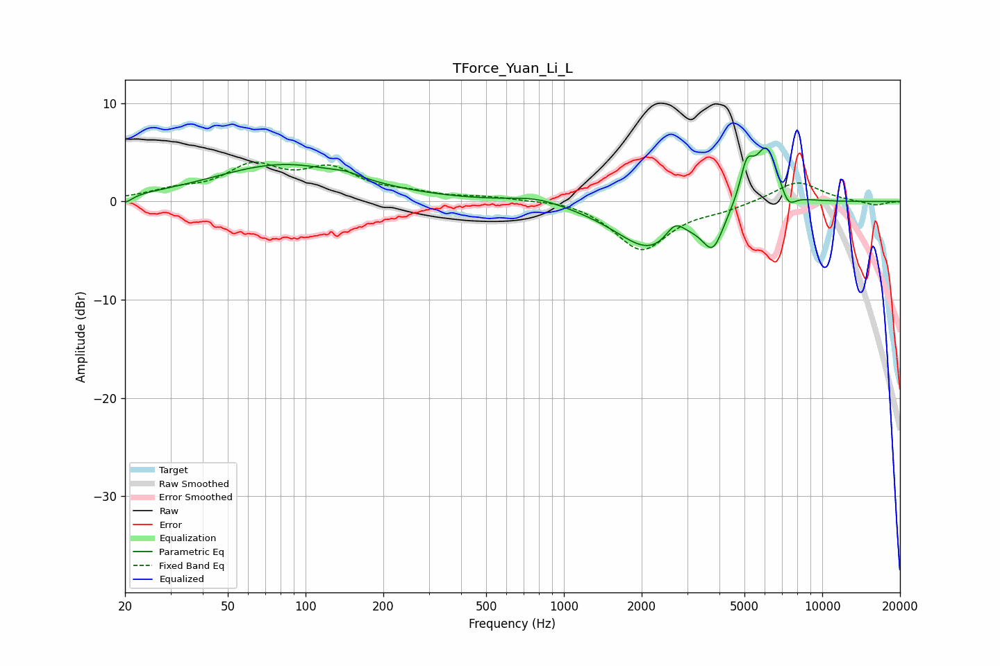

# TForce_Yuan_Li_L
See [usage instructions](https://github.com/jaakkopasanen/AutoEq#usage) for more options and info.

### Parametric EQs
Apply preamp of -5.6 dB when using parametric equalizer.

|   # | Type    |   Fc (Hz) |    Q |   Gain (dB) |
|-----|---------|-----------|------|-------------|
|   1 | Peaking |        20 | 4.97 |        -0.8 |
|   2 | Peaking |        83 | 0.52 |         3.7 |
|   3 | Peaking |       144 | 2.92 |         0.4 |
|   4 | Peaking |       787 | 1.36 |         0.7 |
|   5 | Peaking |      2185 | 1.03 |        -4.9 |
|   6 | Peaking |      2690 | 3.78 |         1.8 |
|   7 | Peaking |      3776 | 3.42 |        -3.7 |
|   8 | Peaking |      5100 | 5.36 |         3.4 |
|   9 | Peaking |      6092 | 2.91 |         6   |
|  10 | Peaking |      7361 | 4.48 |        -1.8 |

### Fixed Band EQs
When using fixed band (also called graphic) equalizer, apply preamp of **-4.1 dB** (if available) and set gains manually with these parameters.

|   # | Type    |   Fc (Hz) |    Q |   Gain (dB) |
|-----|---------|-----------|------|-------------|
|   1 | Peaking |        31 | 1.41 |         0.9 |
|   2 | Peaking |        62 | 1.41 |         3.3 |
|   3 | Peaking |       125 | 1.41 |         2.9 |
|   4 | Peaking |       250 | 1.41 |         0.6 |
|   5 | Peaking |       500 | 1.41 |         0.4 |
|   6 | Peaking |      1000 | 1.41 |         0.3 |
|   7 | Peaking |      2000 | 1.41 |        -4.9 |
|   8 | Peaking |      4000 | 1.41 |        -0.7 |
|   9 | Peaking |      8000 | 1.41 |         2.1 |
|  10 | Peaking |     16000 | 1.41 |        -0.4 |

### Graphs

