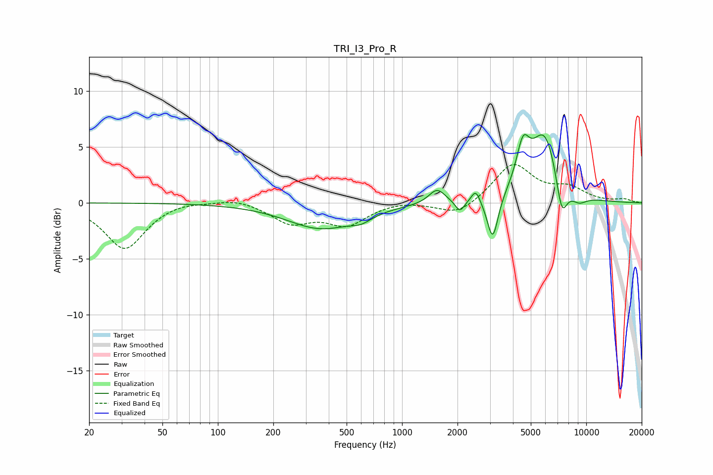

# TRI_I3_Pro_R
See [usage instructions](https://github.com/jaakkopasanen/AutoEq#usage) for more options and info.

### Parametric EQs
Apply preamp of -6.2 dB when using parametric equalizer.

|   # | Type    |   Fc (Hz) |    Q |   Gain (dB) |
|-----|---------|-----------|------|-------------|
|   1 | Peaking |       363 | 0.76 |        -2.3 |
|   2 | Peaking |       599 | 2.5  |        -0.6 |
|   3 | Peaking |      1549 | 3.23 |         1.3 |
|   4 | Peaking |      2060 | 5.66 |        -1   |
|   5 | Peaking |      2514 | 6    |         1.2 |
|   6 | Peaking |      3106 | 4.77 |        -4   |
|   7 | Peaking |      4531 | 3.94 |         3.5 |
|   8 | Peaking |      5945 | 1.78 |         6.2 |
|   9 | Peaking |      7357 | 4.23 |        -3.6 |
|  10 | Peaking |      9092 | 2.85 |        -0.9 |

### Fixed Band EQs
When using fixed band (also called graphic) equalizer, apply preamp of **-3.5 dB** (if available) and set gains manually with these parameters.

|   # | Type    |   Fc (Hz) |    Q |   Gain (dB) |
|-----|---------|-----------|------|-------------|
|   1 | Peaking |        31 | 1.41 |        -4.1 |
|   2 | Peaking |        62 | 1.41 |         0.3 |
|   3 | Peaking |       125 | 1.41 |         0.5 |
|   4 | Peaking |       250 | 1.41 |        -1.7 |
|   5 | Peaking |       500 | 1.41 |        -1.9 |
|   6 | Peaking |      1000 | 1.41 |         0.2 |
|   7 | Peaking |      2000 | 1.41 |        -1.2 |
|   8 | Peaking |      4000 | 1.41 |         3.5 |
|   9 | Peaking |      8000 | 1.41 |         1.2 |
|  10 | Peaking |     16000 | 1.41 |         0.3 |

### Graphs

