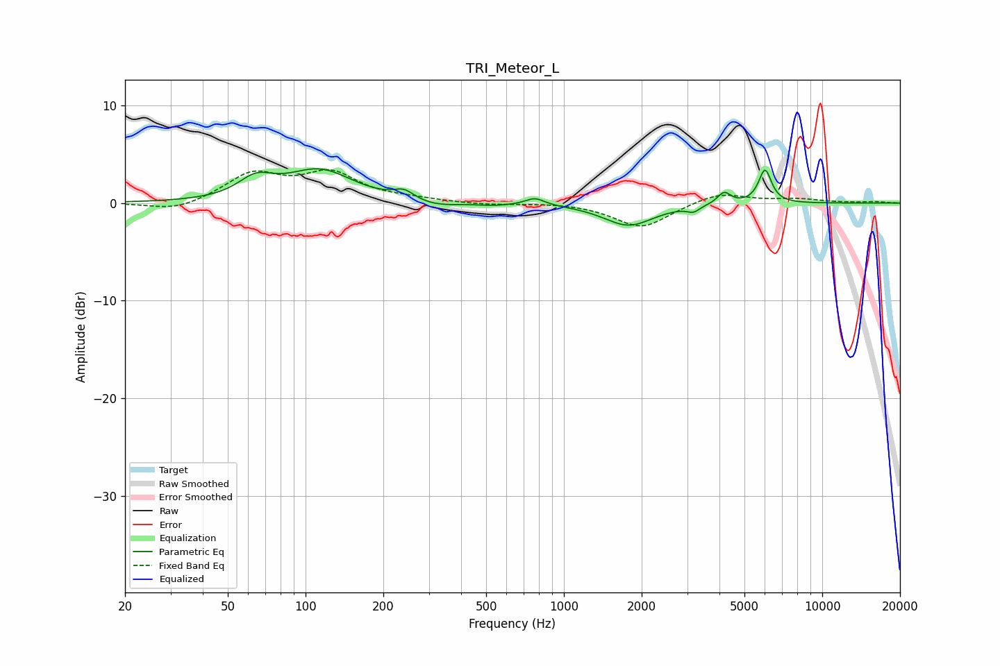

# TRI_Meteor_L
See [usage instructions](https://github.com/jaakkopasanen/AutoEq#usage) for more options and info.

### Parametric EQs
Apply preamp of -3.6 dB when using parametric equalizer.

|   # | Type    |   Fc (Hz) |    Q |   Gain (dB) |
|-----|---------|-----------|------|-------------|
|   1 | Peaking |        64 | 2.09 |         1.9 |
|   2 | Peaking |       113 | 1.1  |         3.2 |
|   3 | Peaking |       240 | 3.73 |         0.9 |
|   4 | Peaking |       320 | 1.73 |        -0.5 |
|   5 | Peaking |       535 | 2.02 |        -0.2 |
|   6 | Peaking |       772 | 3.87 |         0.7 |
|   7 | Peaking |      1780 | 1.46 |        -2.3 |
|   8 | Peaking |      3171 | 6    |        -0.6 |
|   9 | Peaking |      4168 | 5.55 |         1.2 |
|  10 | Peaking |      6005 | 5.61 |         3.4 |

### Fixed Band EQs
When using fixed band (also called graphic) equalizer, apply preamp of **-3.5 dB** (if available) and set gains manually with these parameters.

|   # | Type    |   Fc (Hz) |    Q |   Gain (dB) |
|-----|---------|-----------|------|-------------|
|   1 | Peaking |        31 | 1.41 |        -0.9 |
|   2 | Peaking |        62 | 1.41 |         2.9 |
|   3 | Peaking |       125 | 1.41 |         2.9 |
|   4 | Peaking |       250 | 1.41 |         0.3 |
|   5 | Peaking |       500 | 1.41 |        -0.2 |
|   6 | Peaking |      1000 | 1.41 |         0.1 |
|   7 | Peaking |      2000 | 1.41 |        -2.6 |
|   8 | Peaking |      4000 | 1.41 |         1.1 |
|   9 | Peaking |      8000 | 1.41 |         0.4 |
|  10 | Peaking |     16000 | 1.41 |         0.1 |

### Graphs

