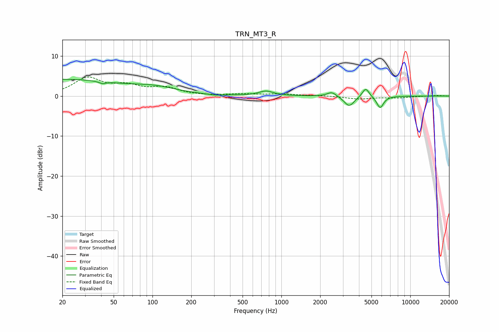

# TRN_MT3_R
See [usage instructions](https://github.com/jaakkopasanen/AutoEq#usage) for more options and info.

### Parametric EQs
Apply preamp of -4.3 dB when using parametric equalizer.

|   # | Type    |   Fc (Hz) |    Q |   Gain (dB) |
|-----|---------|-----------|------|-------------|
|   1 | Peaking |        20 | 0.3  |         4.1 |
|   2 | Peaking |        40 | 6    |         3.1 |
|   3 | Peaking |        40 | 5.84 |        -3.6 |
|   4 | Peaking |       106 | 0.85 |         1.4 |
|   5 | Peaking |       303 | 3.35 |        -0.2 |
|   6 | Peaking |       761 | 2.52 |         1.2 |
|   7 | Peaking |      2464 | 4.02 |         1.1 |
|   8 | Peaking |      3358 | 3.61 |        -2.6 |
|   9 | Peaking |      4509 | 5.34 |         2.3 |
|  10 | Peaking |      5835 | 5.24 |        -3   |

### Fixed Band EQs
When using fixed band (also called graphic) equalizer, apply preamp of **-4.8 dB** (if available) and set gains manually with these parameters.

|   # | Type    |   Fc (Hz) |    Q |   Gain (dB) |
|-----|---------|-----------|------|-------------|
|   1 | Peaking |        31 | 1.41 |         4.3 |
|   2 | Peaking |        62 | 1.41 |         2.2 |
|   3 | Peaking |       125 | 1.41 |         1.9 |
|   4 | Peaking |       250 | 1.41 |        -0   |
|   5 | Peaking |       500 | 1.41 |         0.4 |
|   6 | Peaking |      1000 | 1.41 |         0.5 |
|   7 | Peaking |      2000 | 1.41 |         0.1 |
|   8 | Peaking |      4000 | 1.41 |        -0.7 |
|   9 | Peaking |      8000 | 1.41 |        -0.4 |
|  10 | Peaking |     16000 | 1.41 |         0.1 |

### Graphs

