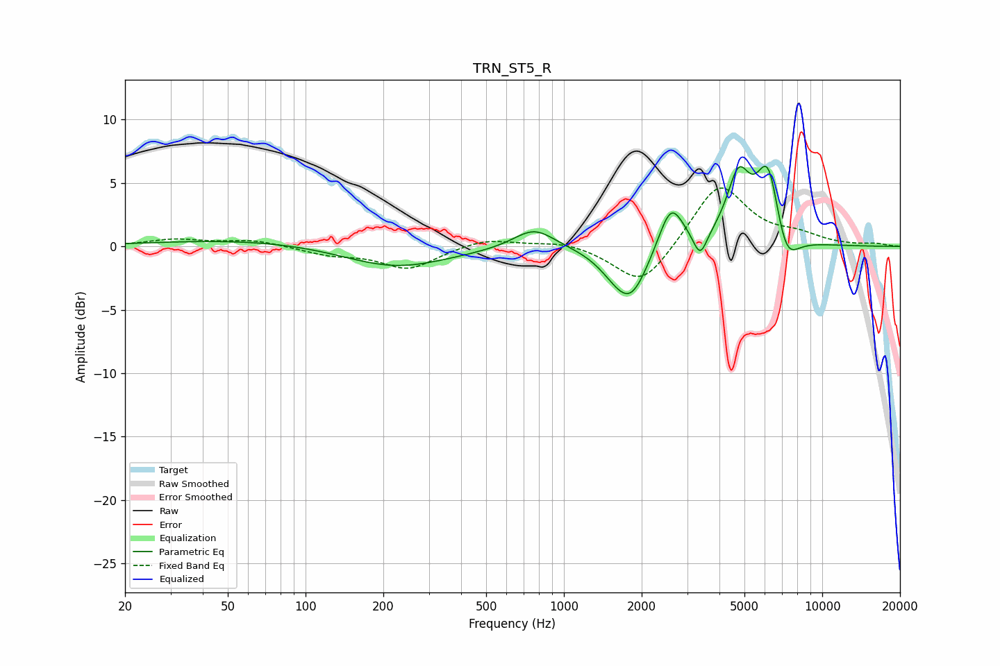

# TRN_ST5_R
See [usage instructions](https://github.com/jaakkopasanen/AutoEq#usage) for more options and info.

### Parametric EQs
Apply preamp of -6.4 dB when using parametric equalizer.

|   # | Type    |   Fc (Hz) |    Q |   Gain (dB) |
|-----|---------|-----------|------|-------------|
|   1 | Peaking |        68 | 0.37 |         0.6 |
|   2 | Peaking |       221 | 0.69 |        -1.8 |
|   3 | Peaking |       767 | 1.75 |         1.7 |
|   4 | Peaking |      1565 | 2.1  |        -0.9 |
|   5 | Peaking |      1818 | 2.07 |        -3.9 |
|   6 | Peaking |      2597 | 2.92 |         3.7 |
|   7 | Peaking |      3368 | 5.36 |        -2   |
|   8 | Peaking |      4739 | 3.09 |         5   |
|   9 | Peaking |      6184 | 2.89 |         6.6 |
|  10 | Peaking |      7192 | 2.78 |        -3.2 |

### Fixed Band EQs
When using fixed band (also called graphic) equalizer, apply preamp of **-4.7 dB** (if available) and set gains manually with these parameters.

|   # | Type    |   Fc (Hz) |    Q |   Gain (dB) |
|-----|---------|-----------|------|-------------|
|   1 | Peaking |        31 | 1.41 |         0.5 |
|   2 | Peaking |        62 | 1.41 |         0.5 |
|   3 | Peaking |       125 | 1.41 |        -0.6 |
|   4 | Peaking |       250 | 1.41 |        -1.7 |
|   5 | Peaking |       500 | 1.41 |         0.7 |
|   6 | Peaking |      1000 | 1.41 |         0.5 |
|   7 | Peaking |      2000 | 1.41 |        -3.3 |
|   8 | Peaking |      4000 | 1.41 |         5   |
|   9 | Peaking |      8000 | 1.41 |         0.7 |
|  10 | Peaking |     16000 | 1.41 |         0.2 |

### Graphs

