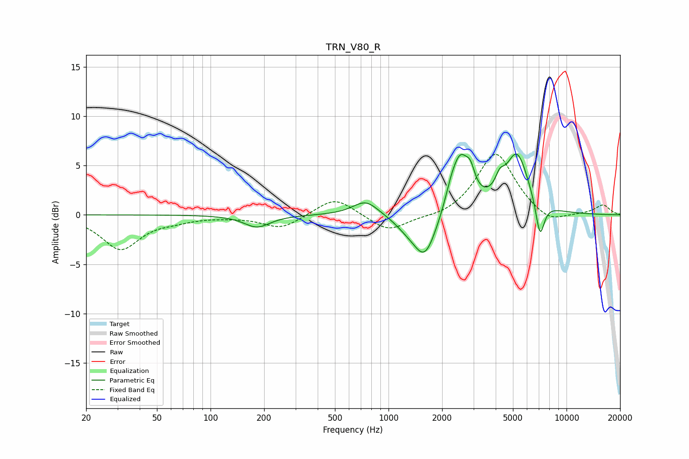

# TRN_V80_R
See [usage instructions](https://github.com/jaakkopasanen/AutoEq#usage) for more options and info.

### Parametric EQs
Apply preamp of -6.3 dB when using parametric equalizer.

|   # | Type    |   Fc (Hz) |    Q |   Gain (dB) |
|-----|---------|-----------|------|-------------|
|   1 | Peaking |       183 | 1.93 |        -1.2 |
|   2 | Peaking |       745 | 1.95 |         1.6 |
|   3 | Peaking |      1254 | 2.08 |        -0.7 |
|   4 | Peaking |      1599 | 2.14 |        -4.5 |
|   5 | Peaking |      2239 | 4.34 |         1.1 |
|   6 | Peaking |      2529 | 2.76 |         5.5 |
|   7 | Peaking |      2890 | 5.74 |         1.7 |
|   8 | Peaking |      4217 | 5.48 |         1.4 |
|   9 | Peaking |      5267 | 2.09 |         6   |
|  10 | Peaking |      7097 | 5.49 |        -3.7 |

### Fixed Band EQs
When using fixed band (also called graphic) equalizer, apply preamp of **-6.2 dB** (if available) and set gains manually with these parameters.

|   # | Type    |   Fc (Hz) |    Q |   Gain (dB) |
|-----|---------|-----------|------|-------------|
|   1 | Peaking |        31 | 1.41 |        -3.4 |
|   2 | Peaking |        62 | 1.41 |        -0.4 |
|   3 | Peaking |       125 | 1.41 |        -0.1 |
|   4 | Peaking |       250 | 1.41 |        -1.4 |
|   5 | Peaking |       500 | 1.41 |         1.9 |
|   6 | Peaking |      1000 | 1.41 |        -1.8 |
|   7 | Peaking |      2000 | 1.41 |        -0.4 |
|   8 | Peaking |      4000 | 1.41 |         6.4 |
|   9 | Peaking |      8000 | 1.41 |        -1.1 |
|  10 | Peaking |     16000 | 1.41 |         1   |

### Graphs

