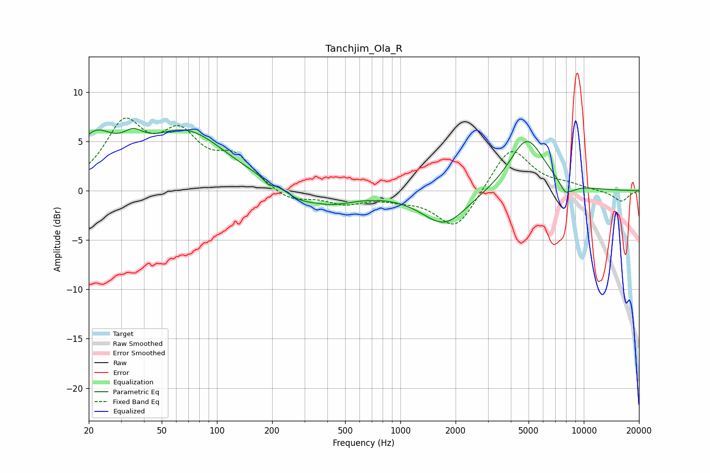

# Tanchjim_Ola_R
See [usage instructions](https://github.com/jaakkopasanen/AutoEq#usage) for more options and info.

### Parametric EQs
Apply preamp of -6.4 dB when using parametric equalizer.

|   # | Type    |   Fc (Hz) |    Q |   Gain (dB) |
|-----|---------|-----------|------|-------------|
|   1 | Peaking |        21 | 1.36 |         4.5 |
|   2 | Peaking |        35 | 2.45 |         1.6 |
|   3 | Peaking |        68 | 0.64 |         5.8 |
|   4 | Peaking |       191 | 5.99 |        -0.5 |
|   5 | Peaking |       278 | 1.96 |        -0.8 |
|   6 | Peaking |       409 | 1.02 |        -1.4 |
|   7 | Peaking |      1743 | 1.14 |        -3.5 |
|   8 | Peaking |      4889 | 1.46 |         5.4 |
|   9 | Peaking |      8156 | 4.04 |        -2.4 |
|  10 | Peaking |      8272 | 6    |         1.1 |

### Fixed Band EQs
When using fixed band (also called graphic) equalizer, apply preamp of **-7.5 dB** (if available) and set gains manually with these parameters.

|   # | Type    |   Fc (Hz) |    Q |   Gain (dB) |
|-----|---------|-----------|------|-------------|
|   1 | Peaking |        31 | 1.41 |         6.3 |
|   2 | Peaking |        62 | 1.41 |         4.9 |
|   3 | Peaking |       125 | 1.41 |         3   |
|   4 | Peaking |       250 | 1.41 |        -1.2 |
|   5 | Peaking |       500 | 1.41 |        -1.2 |
|   6 | Peaking |      1000 | 1.41 |        -0.6 |
|   7 | Peaking |      2000 | 1.41 |        -4   |
|   8 | Peaking |      4000 | 1.41 |         4.6 |
|   9 | Peaking |      8000 | 1.41 |         0.5 |
|  10 | Peaking |     16000 | 1.41 |        -1.1 |

### Graphs

