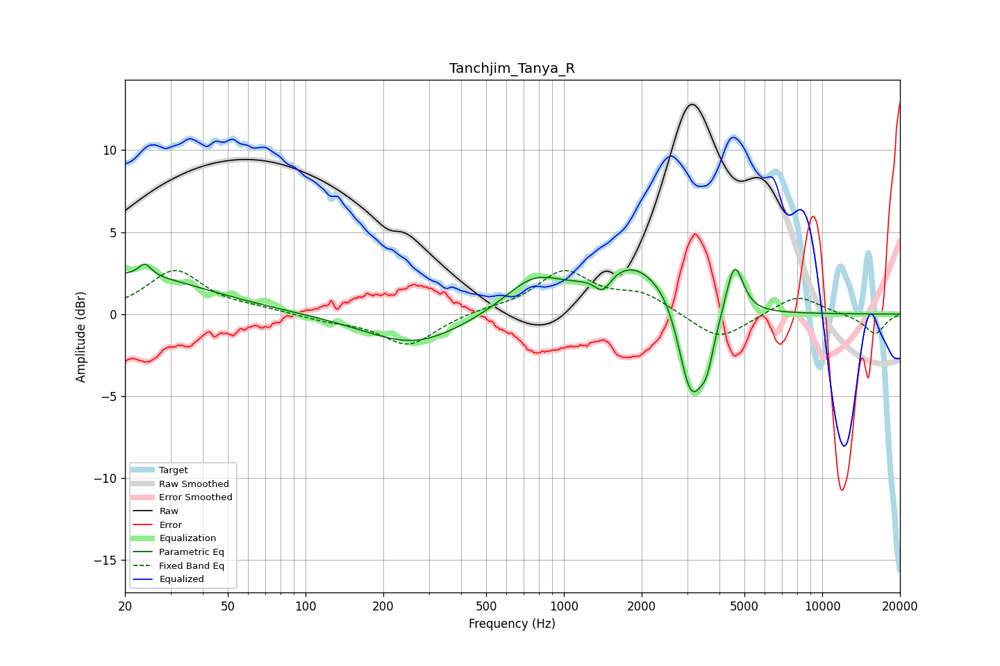

# Tanchjim_Tanya_R
See [usage instructions](https://github.com/jaakkopasanen/AutoEq#usage) for more options and info.

### Parametric EQs
Apply preamp of -3.1 dB when using parametric equalizer.

|   # | Type    |   Fc (Hz) |    Q |   Gain (dB) |
|-----|---------|-----------|------|-------------|
|   1 | Peaking |        20 | 0.46 |         2.4 |
|   2 | Peaking |        24 | 5.99 |         0.7 |
|   3 | Peaking |       263 | 0.75 |        -1.9 |
|   4 | Peaking |       763 | 1.24 |         2   |
|   5 | Peaking |      1415 | 4.49 |        -1.1 |
|   6 | Peaking |      1870 | 0.97 |         3.1 |
|   7 | Peaking |      2600 | 2.29 |         0.9 |
|   8 | Peaking |      3105 | 2.6  |        -6.5 |
|   9 | Peaking |      3581 | 5.52 |        -1.7 |
|  10 | Peaking |      4574 | 4.17 |         3.4 |

### Fixed Band EQs
When using fixed band (also called graphic) equalizer, apply preamp of **-2.8 dB** (if available) and set gains manually with these parameters.

|   # | Type    |   Fc (Hz) |    Q |   Gain (dB) |
|-----|---------|-----------|------|-------------|
|   1 | Peaking |        31 | 1.41 |         2.6 |
|   2 | Peaking |        62 | 1.41 |         0.3 |
|   3 | Peaking |       125 | 1.41 |        -0.4 |
|   4 | Peaking |       250 | 1.41 |        -1.9 |
|   5 | Peaking |       500 | 1.41 |         0.2 |
|   6 | Peaking |      1000 | 1.41 |         2.5 |
|   7 | Peaking |      2000 | 1.41 |         1.1 |
|   8 | Peaking |      4000 | 1.41 |        -1.7 |
|   9 | Peaking |      8000 | 1.41 |         1.2 |
|  10 | Peaking |     16000 | 1.41 |        -1.2 |

### Graphs

