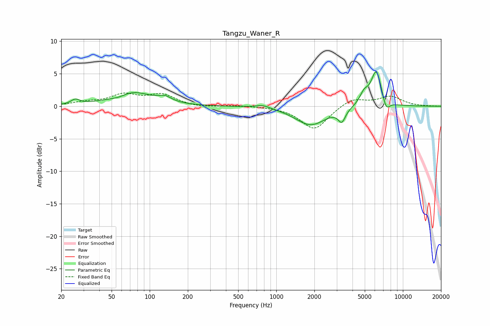

# Tangzu_Waner_R
See [usage instructions](https://github.com/jaakkopasanen/AutoEq#usage) for more options and info.

### Parametric EQs
Apply preamp of -5.4 dB when using parametric equalizer.

|   # | Type    |   Fc (Hz) |    Q |   Gain (dB) |
|-----|---------|-----------|------|-------------|
|   1 | Peaking |        26 | 4.26 |         0.8 |
|   2 | Peaking |        57 | 1.99 |        -0.6 |
|   3 | Peaking |        71 | 0.95 |         2.3 |
|   4 | Peaking |       132 | 2.67 |         0.8 |
|   5 | Peaking |       784 | 2.51 |         0.5 |
|   6 | Peaking |      1868 | 1.17 |        -2.9 |
|   7 | Peaking |      3292 | 5.01 |        -1.9 |
|   8 | Peaking |      4934 | 3.98 |         1.6 |
|   9 | Peaking |      6171 | 3.26 |         5.6 |
|  10 | Peaking |      7360 | 4.54 |        -1.9 |

### Fixed Band EQs
When using fixed band (also called graphic) equalizer, apply preamp of **-2.1 dB** (if available) and set gains manually with these parameters.

|   # | Type    |   Fc (Hz) |    Q |   Gain (dB) |
|-----|---------|-----------|------|-------------|
|   1 | Peaking |        31 | 1.41 |         0.5 |
|   2 | Peaking |        62 | 1.41 |         1.6 |
|   3 | Peaking |       125 | 1.41 |         1.7 |
|   4 | Peaking |       250 | 1.41 |        -0.2 |
|   5 | Peaking |       500 | 1.41 |         0.1 |
|   6 | Peaking |      1000 | 1.41 |        -0   |
|   7 | Peaking |      2000 | 1.41 |        -3.6 |
|   8 | Peaking |      4000 | 1.41 |         1.3 |
|   9 | Peaking |      8000 | 1.41 |         1.5 |
|  10 | Peaking |     16000 | 1.41 |        -0   |

### Graphs

