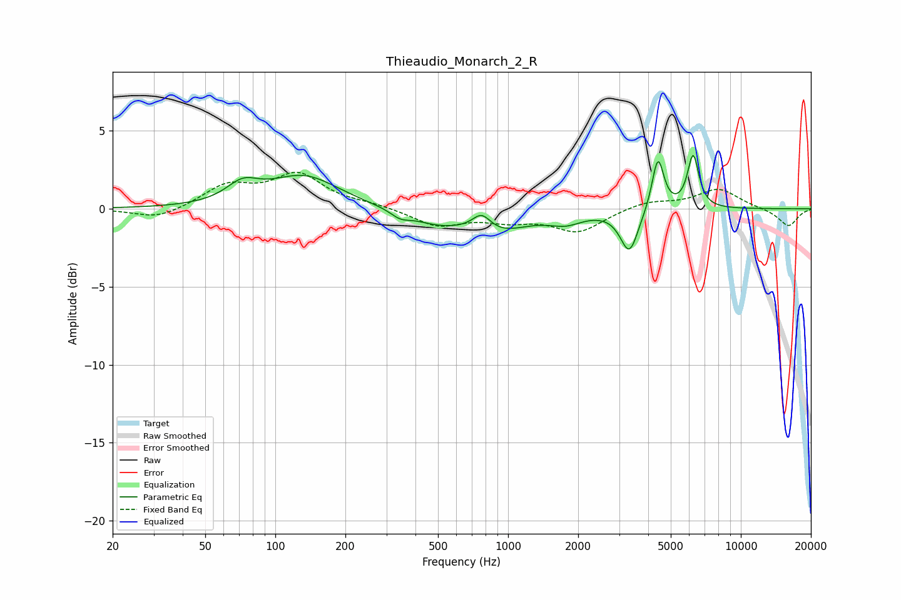

# Thieaudio_Monarch_2_R
See [usage instructions](https://github.com/jaakkopasanen/AutoEq#usage) for more options and info.

### Parametric EQs
Apply preamp of -3.5 dB when using parametric equalizer.

|   # | Type    |   Fc (Hz) |    Q |   Gain (dB) |
|-----|---------|-----------|------|-------------|
|   1 | Peaking |        72 | 2.07 |         1.1 |
|   2 | Peaking |       133 | 0.94 |         2.1 |
|   3 | Peaking |       344 | 3.46 |        -0.4 |
|   4 | Peaking |       495 | 1.17 |        -0.8 |
|   5 | Peaking |       770 | 3.5  |         1.1 |
|   6 | Peaking |       899 | 1.06 |        -1.3 |
|   7 | Peaking |      1764 | 1.99 |        -0.7 |
|   8 | Peaking |      3320 | 3.68 |        -2.7 |
|   9 | Peaking |      4403 | 5.55 |         3.4 |
|  10 | Peaking |      6239 | 5.7  |         3.4 |

### Fixed Band EQs
When using fixed band (also called graphic) equalizer, apply preamp of **-2.4 dB** (if available) and set gains manually with these parameters.

|   # | Type    |   Fc (Hz) |    Q |   Gain (dB) |
|-----|---------|-----------|------|-------------|
|   1 | Peaking |        31 | 1.41 |        -0.7 |
|   2 | Peaking |        62 | 1.41 |         1.4 |
|   3 | Peaking |       125 | 1.41 |         2.1 |
|   4 | Peaking |       250 | 1.41 |         0.2 |
|   5 | Peaking |       500 | 1.41 |        -1.1 |
|   6 | Peaking |      1000 | 1.41 |        -0.6 |
|   7 | Peaking |      2000 | 1.41 |        -1.4 |
|   8 | Peaking |      4000 | 1.41 |         0.5 |
|   9 | Peaking |      8000 | 1.41 |         1.3 |
|  10 | Peaking |     16000 | 1.41 |        -1.1 |

### Graphs

