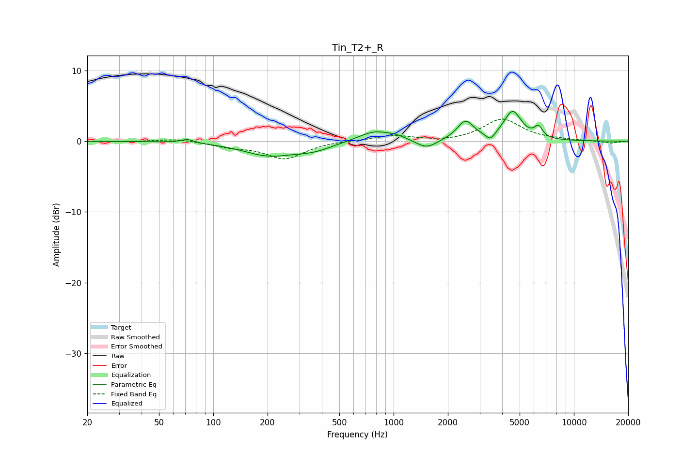

# Tin_T2+_R
See [usage instructions](https://github.com/jaakkopasanen/AutoEq#usage) for more options and info.

### Parametric EQs
Apply preamp of -4.3 dB when using parametric equalizer.

|   # | Type    |   Fc (Hz) |    Q |   Gain (dB) |
|-----|---------|-----------|------|-------------|
|   1 | Peaking |        72 | 4.14 |         0.5 |
|   2 | Peaking |       203 | 0.99 |        -1.9 |
|   3 | Peaking |       360 | 1.36 |        -1   |
|   4 | Peaking |       788 | 1.51 |         1.5 |
|   5 | Peaking |      1045 | 2.79 |         0.4 |
|   6 | Peaking |      1521 | 2.53 |        -1.3 |
|   7 | Peaking |      2505 | 3.08 |         2.7 |
|   8 | Peaking |      3442 | 5.62 |        -1.1 |
|   9 | Peaking |      4573 | 2.88 |         4.1 |
|  10 | Peaking |      6359 | 6    |         1.5 |

### Fixed Band EQs
When using fixed band (also called graphic) equalizer, apply preamp of **-3.2 dB** (if available) and set gains manually with these parameters.

|   # | Type    |   Fc (Hz) |    Q |   Gain (dB) |
|-----|---------|-----------|------|-------------|
|   1 | Peaking |        31 | 1.41 |        -0.1 |
|   2 | Peaking |        62 | 1.41 |         0.4 |
|   3 | Peaking |       125 | 1.41 |        -0.7 |
|   4 | Peaking |       250 | 1.41 |        -2.4 |
|   5 | Peaking |       500 | 1.41 |         0.1 |
|   6 | Peaking |      1000 | 1.41 |         0.8 |
|   7 | Peaking |      2000 | 1.41 |        -0.2 |
|   8 | Peaking |      4000 | 1.41 |         3.1 |
|   9 | Peaking |      8000 | 1.41 |         0.1 |
|  10 | Peaking |     16000 | 1.41 |        -0.3 |

### Graphs

