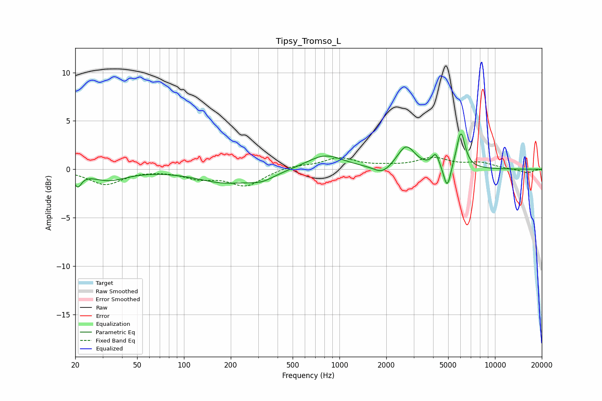

# Tipsy_Tromso_L
See [usage instructions](https://github.com/jaakkopasanen/AutoEq#usage) for more options and info.

### Parametric EQs
Apply preamp of -3.7 dB when using parametric equalizer.

|   # | Type    |   Fc (Hz) |    Q |   Gain (dB) |
|-----|---------|-----------|------|-------------|
|   1 | Peaking |        21 | 5.93 |        -1.4 |
|   2 | Peaking |        33 | 1.25 |        -1.1 |
|   3 | Peaking |       182 | 0.79 |        -1.3 |
|   4 | Peaking |       316 | 1.64 |        -0.8 |
|   5 | Peaking |       808 | 1.21 |         1.5 |
|   6 | Peaking |      1889 | 2.57 |        -0.9 |
|   7 | Peaking |      2685 | 2.54 |         2.4 |
|   8 | Peaking |      4157 | 5.9  |         1.4 |
|   9 | Peaking |      4929 | 5.98 |        -2.5 |
|  10 | Peaking |      6033 | 4.98 |         3.8 |

### Fixed Band EQs
When using fixed band (also called graphic) equalizer, apply preamp of **-1.3 dB** (if available) and set gains manually with these parameters.

|   # | Type    |   Fc (Hz) |    Q |   Gain (dB) |
|-----|---------|-----------|------|-------------|
|   1 | Peaking |        31 | 1.41 |        -1.5 |
|   2 | Peaking |        62 | 1.41 |         0   |
|   3 | Peaking |       125 | 1.41 |        -0.8 |
|   4 | Peaking |       250 | 1.41 |        -1.7 |
|   5 | Peaking |       500 | 1.41 |         0.4 |
|   6 | Peaking |      1000 | 1.41 |         1.1 |
|   7 | Peaking |      2000 | 1.41 |         0.2 |
|   8 | Peaking |      4000 | 1.41 |         1.1 |
|   9 | Peaking |      8000 | 1.41 |         0.6 |
|  10 | Peaking |     16000 | 1.41 |        -0.4 |

### Graphs

