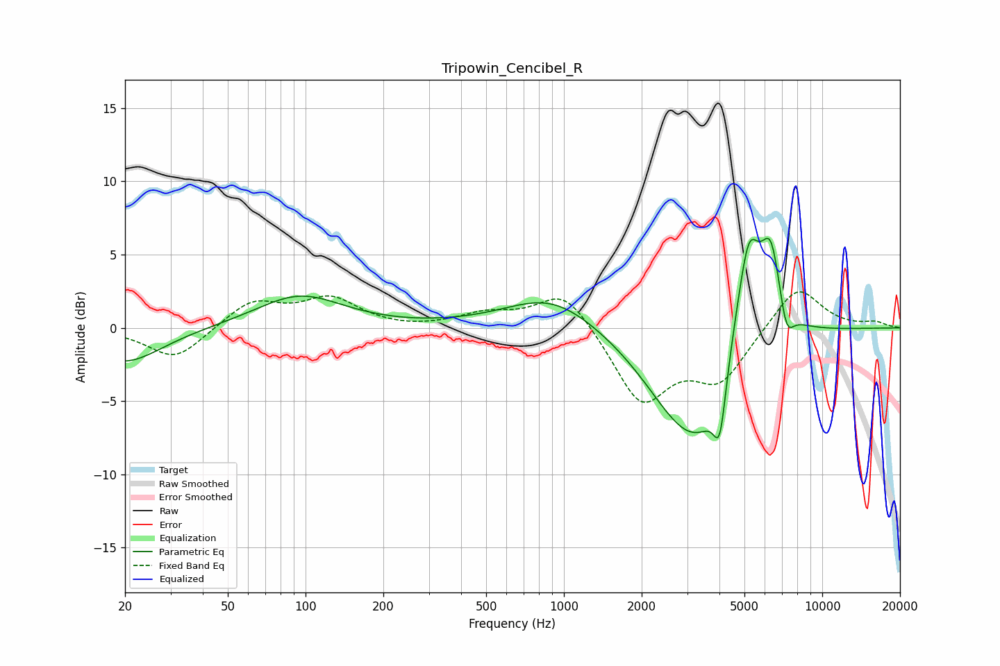

# Tripowin_Cencibel_R
See [usage instructions](https://github.com/jaakkopasanen/AutoEq#usage) for more options and info.

### Parametric EQs
Apply preamp of -6.2 dB when using parametric equalizer.

|   # | Type    |   Fc (Hz) |    Q |   Gain (dB) |
|-----|---------|-----------|------|-------------|
|   1 | Peaking |        20 | 0.99 |        -2.4 |
|   2 | Peaking |        95 | 0.84 |         2.2 |
|   3 | Peaking |       898 | 0.8  |         2.3 |
|   4 | Peaking |      2816 | 0.91 |        -3.7 |
|   5 | Peaking |      3601 | 1.05 |        -5.9 |
|   6 | Peaking |      4014 | 5.89 |        -3.9 |
|   7 | Peaking |      5077 | 1.67 |         6.5 |
|   8 | Peaking |      5200 | 4.07 |         3.1 |
|   9 | Peaking |      6336 | 3.51 |         5   |
|  10 | Peaking |      7263 | 4.94 |        -2.2 |

### Fixed Band EQs
When using fixed band (also called graphic) equalizer, apply preamp of **-2.6 dB** (if available) and set gains manually with these parameters.

|   # | Type    |   Fc (Hz) |    Q |   Gain (dB) |
|-----|---------|-----------|------|-------------|
|   1 | Peaking |        31 | 1.41 |        -2.2 |
|   2 | Peaking |        62 | 1.41 |         1.8 |
|   3 | Peaking |       125 | 1.41 |         1.9 |
|   4 | Peaking |       250 | 1.41 |        -0.1 |
|   5 | Peaking |       500 | 1.41 |         0.9 |
|   6 | Peaking |      1000 | 1.41 |         2.7 |
|   7 | Peaking |      2000 | 1.41 |        -5.1 |
|   8 | Peaking |      4000 | 1.41 |        -3.4 |
|   9 | Peaking |      8000 | 1.41 |         3   |
|  10 | Peaking |     16000 | 1.41 |         0.4 |

### Graphs

