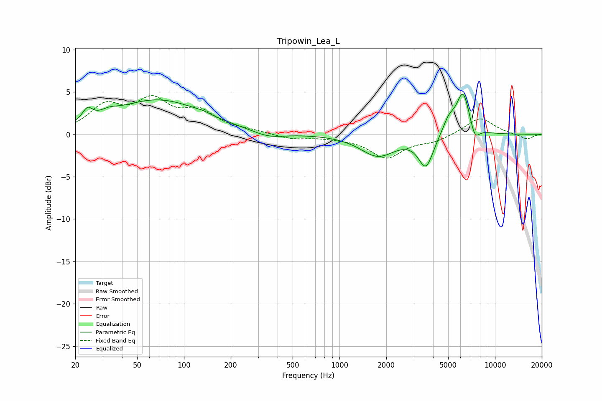

# Tripowin_Lea_L
See [usage instructions](https://github.com/jaakkopasanen/AutoEq#usage) for more options and info.

### Parametric EQs
Apply preamp of -4.8 dB when using parametric equalizer.

|   # | Type    |   Fc (Hz) |    Q |   Gain (dB) |
|-----|---------|-----------|------|-------------|
|   1 | Peaking |        24 | 4.51 |         1.4 |
|   2 | Peaking |        33 | 2.65 |         0.6 |
|   3 | Peaking |        68 | 0.49 |         4   |
|   4 | Peaking |       132 | 3.09 |         0.2 |
|   5 | Peaking |       350 | 1.4  |        -0.7 |
|   6 | Peaking |      1766 | 1.26 |        -2.5 |
|   7 | Peaking |      3596 | 2.97 |        -3.7 |
|   8 | Peaking |      5043 | 3.46 |         1.7 |
|   9 | Peaking |      6236 | 3.15 |         5   |
|  10 | Peaking |      7409 | 4.46 |        -1.7 |

### Fixed Band EQs
When using fixed band (also called graphic) equalizer, apply preamp of **-4.7 dB** (if available) and set gains manually with these parameters.

|   # | Type    |   Fc (Hz) |    Q |   Gain (dB) |
|-----|---------|-----------|------|-------------|
|   1 | Peaking |        31 | 1.41 |         3.1 |
|   2 | Peaking |        62 | 1.41 |         3.6 |
|   3 | Peaking |       125 | 1.41 |         2.4 |
|   4 | Peaking |       250 | 1.41 |         0.3 |
|   5 | Peaking |       500 | 1.41 |        -0.5 |
|   6 | Peaking |      1000 | 1.41 |        -0.3 |
|   7 | Peaking |      2000 | 1.41 |        -2.7 |
|   8 | Peaking |      4000 | 1.41 |        -0.7 |
|   9 | Peaking |      8000 | 1.41 |         2   |
|  10 | Peaking |     16000 | 1.41 |        -0.6 |

### Graphs

