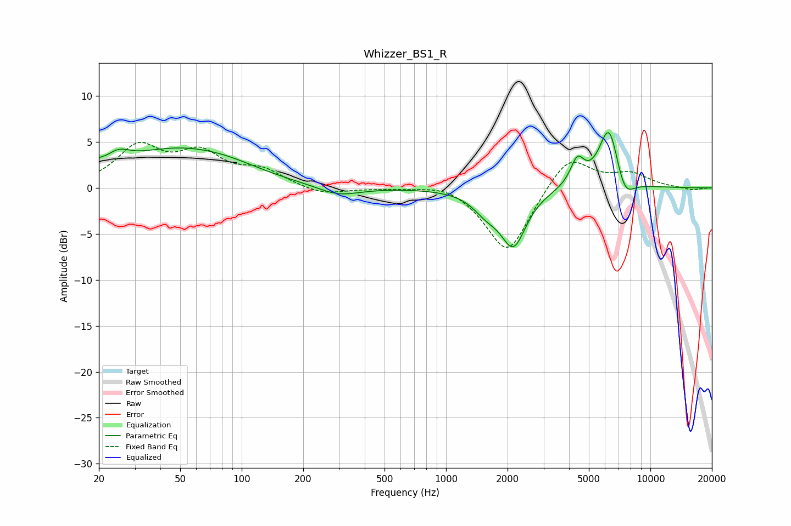

# Whizzer_BS1_R
See [usage instructions](https://github.com/jaakkopasanen/AutoEq#usage) for more options and info.

### Parametric EQs
Apply preamp of -6.1 dB when using parametric equalizer.

|   # | Type    |   Fc (Hz) |    Q |   Gain (dB) |
|-----|---------|-----------|------|-------------|
|   1 | Peaking |        20 | 5.98 |         0.5 |
|   2 | Peaking |        25 | 2.43 |         1.4 |
|   3 | Peaking |        48 | 0.49 |         4   |
|   4 | Peaking |        85 | 0.88 |         0.6 |
|   5 | Peaking |       297 | 1.35 |        -1.1 |
|   6 | Peaking |      1573 | 2.14 |        -1.7 |
|   7 | Peaking |      2136 | 2.25 |        -5.9 |
|   8 | Peaking |      4392 | 4.14 |         2.8 |
|   9 | Peaking |      6281 | 2.71 |         7.1 |
|  10 | Peaking |      7447 | 2.89 |        -2.8 |

### Fixed Band EQs
When using fixed band (also called graphic) equalizer, apply preamp of **-5.1 dB** (if available) and set gains manually with these parameters.

|   # | Type    |   Fc (Hz) |    Q |   Gain (dB) |
|-----|---------|-----------|------|-------------|
|   1 | Peaking |        31 | 1.41 |         4.3 |
|   2 | Peaking |        62 | 1.41 |         3.4 |
|   3 | Peaking |       125 | 1.41 |         1.7 |
|   4 | Peaking |       250 | 1.41 |        -0.8 |
|   5 | Peaking |       500 | 1.41 |        -0   |
|   6 | Peaking |      1000 | 1.41 |         0.7 |
|   7 | Peaking |      2000 | 1.41 |        -7.3 |
|   8 | Peaking |      4000 | 1.41 |         3.8 |
|   9 | Peaking |      8000 | 1.41 |         1.4 |
|  10 | Peaking |     16000 | 1.41 |        -0.3 |

### Graphs

