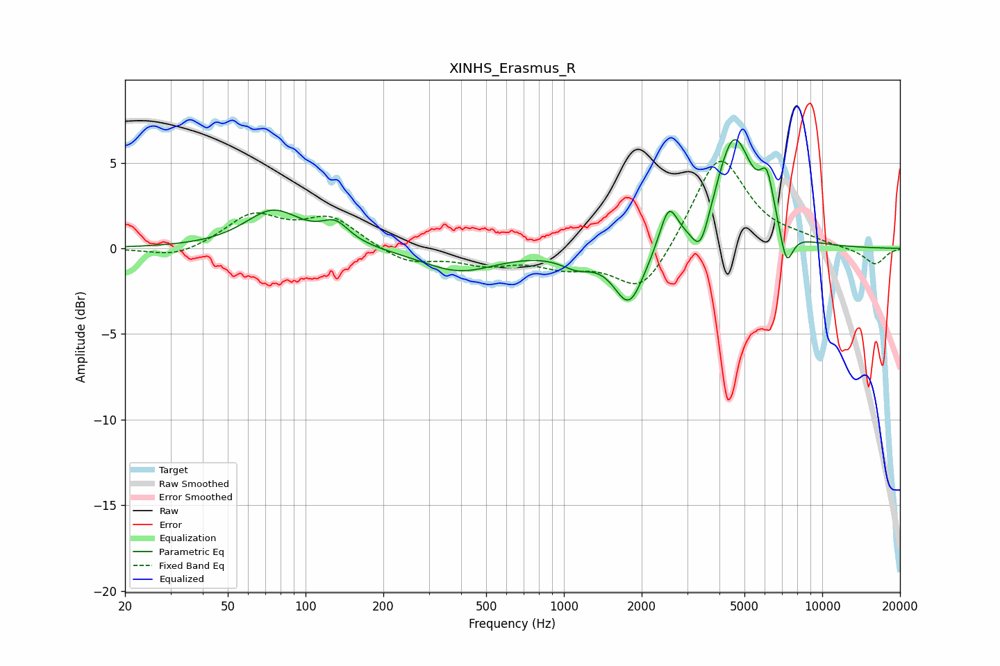

# XINHS_Erasmus_R
See [usage instructions](https://github.com/jaakkopasanen/AutoEq#usage) for more options and info.

### Parametric EQs
Apply preamp of -6.5 dB when using parametric equalizer.

|   # | Type    |   Fc (Hz) |    Q |   Gain (dB) |
|-----|---------|-----------|------|-------------|
|   1 | Peaking |        75 | 1.3  |         2.2 |
|   2 | Peaking |       130 | 2.59 |         1.1 |
|   3 | Peaking |       393 | 0.98 |        -1.3 |
|   4 | Peaking |      1123 | 2.25 |        -0.8 |
|   5 | Peaking |      1789 | 2.41 |        -3.3 |
|   6 | Peaking |      2543 | 4.12 |         2.4 |
|   7 | Peaking |      3382 | 4.13 |        -2.1 |
|   8 | Peaking |      4551 | 1.96 |         6.5 |
|   9 | Peaking |      6111 | 4.95 |         2.6 |
|  10 | Peaking |      7271 | 5.29 |        -2.2 |

### Fixed Band EQs
When using fixed band (also called graphic) equalizer, apply preamp of **-5.2 dB** (if available) and set gains manually with these parameters.

|   # | Type    |   Fc (Hz) |    Q |   Gain (dB) |
|-----|---------|-----------|------|-------------|
|   1 | Peaking |        31 | 1.41 |        -0.6 |
|   2 | Peaking |        62 | 1.41 |         1.9 |
|   3 | Peaking |       125 | 1.41 |         1.7 |
|   4 | Peaking |       250 | 1.41 |        -0.9 |
|   5 | Peaking |       500 | 1.41 |        -0.8 |
|   6 | Peaking |      1000 | 1.41 |        -0.9 |
|   7 | Peaking |      2000 | 1.41 |        -2.8 |
|   8 | Peaking |      4000 | 1.41 |         5.5 |
|   9 | Peaking |      8000 | 1.41 |         0.4 |
|  10 | Peaking |     16000 | 1.41 |        -1   |

### Graphs

