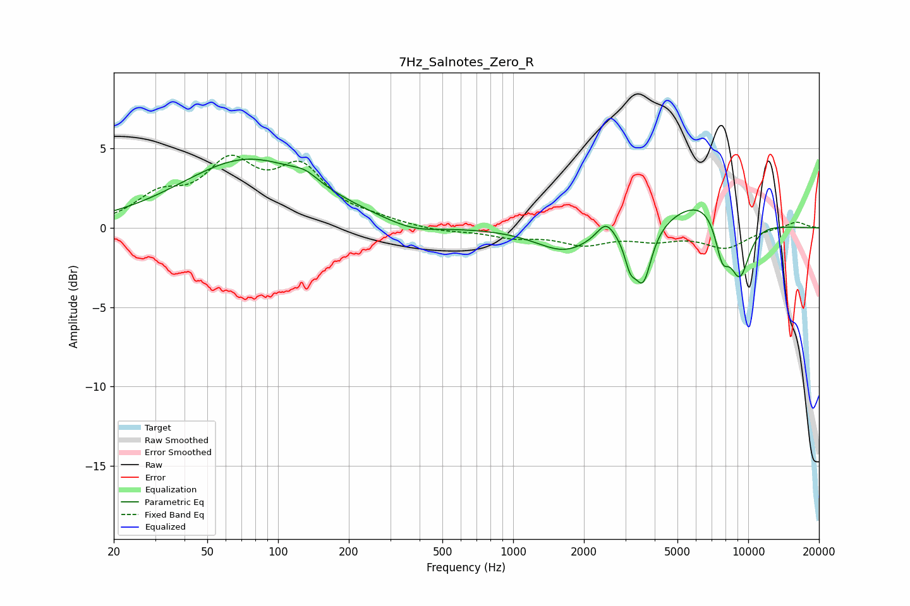

# 7Hz_Salnotes_Zero_R
See [usage instructions](https://github.com/jaakkopasanen/AutoEq#usage) for more options and info.

### Parametric EQs
Apply preamp of -4.4 dB when using parametric equalizer.

|   # | Type    |   Fc (Hz) |    Q |   Gain (dB) |
|-----|---------|-----------|------|-------------|
|   1 | Peaking |        75 | 0.5  |         4.3 |
|   2 | Peaking |       131 | 2.57 |         0.5 |
|   3 | Peaking |       374 | 1.23 |        -0.6 |
|   4 | Peaking |      1660 | 1.16 |        -1.5 |
|   5 | Peaking |      2479 | 3.8  |         1.1 |
|   6 | Peaking |      3146 | 5.98 |        -1.6 |
|   7 | Peaking |      3572 | 3.93 |        -3.5 |
|   8 | Peaking |      6556 | 0.92 |         2.1 |
|   9 | Peaking |      7753 | 4.28 |        -2.5 |
|  10 | Peaking |      9190 | 2.79 |        -3.8 |

### Fixed Band EQs
When using fixed band (also called graphic) equalizer, apply preamp of **-4.7 dB** (if available) and set gains manually with these parameters.

|   # | Type    |   Fc (Hz) |    Q |   Gain (dB) |
|-----|---------|-----------|------|-------------|
|   1 | Peaking |        31 | 1.41 |         1.7 |
|   2 | Peaking |        62 | 1.41 |         3.6 |
|   3 | Peaking |       125 | 1.41 |         3.4 |
|   4 | Peaking |       250 | 1.41 |         0.4 |
|   5 | Peaking |       500 | 1.41 |        -0.2 |
|   6 | Peaking |      1000 | 1.41 |        -0.5 |
|   7 | Peaking |      2000 | 1.41 |        -0.9 |
|   8 | Peaking |      4000 | 1.41 |        -0.6 |
|   9 | Peaking |      8000 | 1.41 |        -1.2 |
|  10 | Peaking |     16000 | 1.41 |         0.4 |

### Graphs

