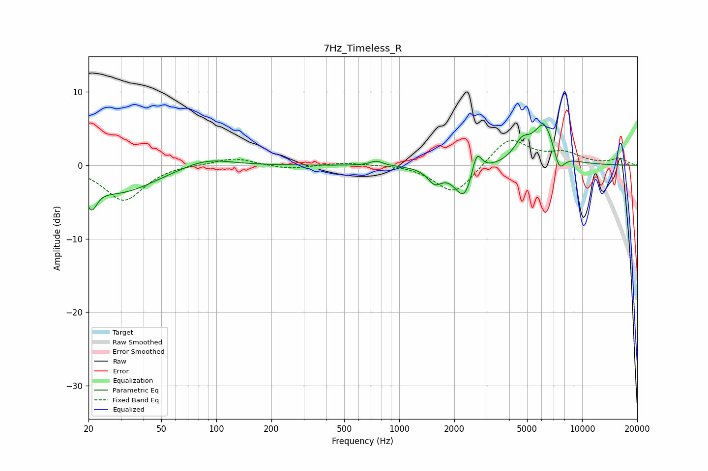

# 7Hz_Timeless_R
See [usage instructions](https://github.com/jaakkopasanen/AutoEq#usage) for more options and info.

### Parametric EQs
Apply preamp of -5.6 dB when using parametric equalizer.

|   # | Type    |   Fc (Hz) |    Q |   Gain (dB) |
|-----|---------|-----------|------|-------------|
|   1 | Peaking |        21 | 4.79 |        -3.2 |
|   2 | Peaking |        29 | 0.71 |        -3.7 |
|   3 | Peaking |        87 | 1.04 |         1.3 |
|   4 | Peaking |       750 | 4.01 |         0.7 |
|   5 | Peaking |      1563 | 3.62 |        -2   |
|   6 | Peaking |      2277 | 2.69 |        -4.8 |
|   7 | Peaking |      2646 | 5.13 |         3.6 |
|   8 | Peaking |      4688 | 3.19 |         2.3 |
|   9 | Peaking |      6224 | 2.26 |         5.7 |
|  10 | Peaking |      7471 | 4.3  |        -3   |

### Fixed Band EQs
When using fixed band (also called graphic) equalizer, apply preamp of **-3.5 dB** (if available) and set gains manually with these parameters.

|   # | Type    |   Fc (Hz) |    Q |   Gain (dB) |
|-----|---------|-----------|------|-------------|
|   1 | Peaking |        31 | 1.41 |        -4.8 |
|   2 | Peaking |        62 | 1.41 |         0.2 |
|   3 | Peaking |       125 | 1.41 |         1.1 |
|   4 | Peaking |       250 | 1.41 |        -0.5 |
|   5 | Peaking |       500 | 1.41 |         0.4 |
|   6 | Peaking |      1000 | 1.41 |         0.2 |
|   7 | Peaking |      2000 | 1.41 |        -4.1 |
|   8 | Peaking |      4000 | 1.41 |         3.8 |
|   9 | Peaking |      8000 | 1.41 |         1.5 |
|  10 | Peaking |     16000 | 1.41 |         0.9 |

### Graphs

