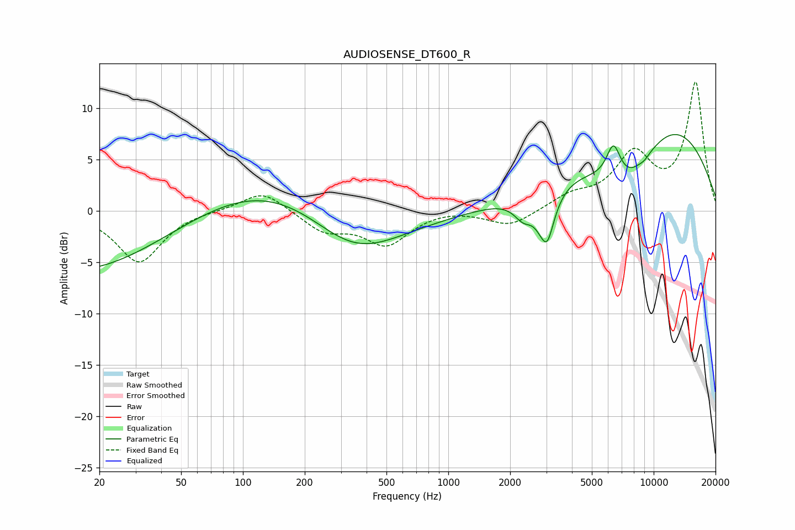

# AUDIOSENSE_DT600_R
See [usage instructions](https://github.com/jaakkopasanen/AutoEq#usage) for more options and info.

### Parametric EQs
Apply preamp of -7.5 dB when using parametric equalizer.

|   # | Type    |   Fc (Hz) |    Q |   Gain (dB) |
|-----|---------|-----------|------|-------------|
|   1 | Peaking |        28 | 0.26 |       -10   |
|   2 | Peaking |       106 | 0.2  |         9.1 |
|   3 | Peaking |       345 | 0.51 |        -8.6 |
|   4 | Peaking |      2325 | 2.97 |        -1.9 |
|   5 | Peaking |      2937 | 5.84 |         1.9 |
|   6 | Peaking |      2977 | 3.92 |        -7   |
|   7 | Peaking |      6373 | 3.94 |         3.4 |
|   8 | Peaking |      7498 | 0.83 |        -6.3 |
|   9 | Peaking |      9037 | 5.98 |        -0.2 |
|  10 | Peaking |      9924 | 0.34 |        10.5 |

### Fixed Band EQs
When using fixed band (also called graphic) equalizer, apply preamp of **-12.6 dB** (if available) and set gains manually with these parameters.

|   # | Type    |   Fc (Hz) |    Q |   Gain (dB) |
|-----|---------|-----------|------|-------------|
|   1 | Peaking |        31 | 1.41 |        -5   |
|   2 | Peaking |        62 | 1.41 |         0.1 |
|   3 | Peaking |       125 | 1.41 |         2.1 |
|   4 | Peaking |       250 | 1.41 |        -1.9 |
|   5 | Peaking |       500 | 1.41 |        -3.2 |
|   6 | Peaking |      1000 | 1.41 |         0.3 |
|   7 | Peaking |      2000 | 1.41 |        -1.5 |
|   8 | Peaking |      4000 | 1.41 |         1.3 |
|   9 | Peaking |      8000 | 1.41 |         5.1 |
|  10 | Peaking |     16000 | 1.41 |        12.4 |

### Graphs

