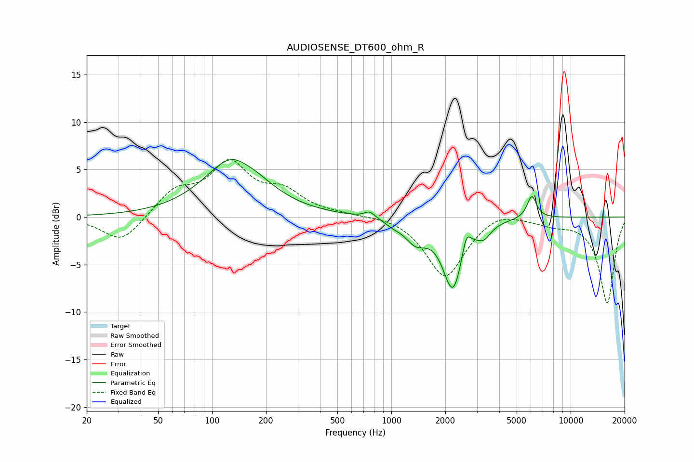

# AUDIOSENSE_DT600_ohm_R
See [usage instructions](https://github.com/jaakkopasanen/AutoEq#usage) for more options and info.

### Parametric EQs
Apply preamp of -6.1 dB when using parametric equalizer.

|   # | Type    |   Fc (Hz) |    Q |   Gain (dB) |
|-----|---------|-----------|------|-------------|
|   1 | Peaking |       134 | 0.88 |         6.3 |
|   2 | Peaking |       151 | 2.75 |        -0.4 |
|   3 | Peaking |       304 | 2.84 |        -0   |
|   4 | Peaking |       757 | 4.7  |         0.7 |
|   5 | Peaking |      1026 | 3.67 |        -0.4 |
|   6 | Peaking |      1368 | 2.29 |        -2.1 |
|   7 | Peaking |      2205 | 2.52 |        -7.4 |
|   8 | Peaking |      2618 | 6    |         2.2 |
|   9 | Peaking |      3281 | 3.72 |        -1.2 |
|  10 | Peaking |      6075 | 5.28 |         2.4 |

### Fixed Band EQs
When using fixed band (also called graphic) equalizer, apply preamp of **-6.2 dB** (if available) and set gains manually with these parameters.

|   # | Type    |   Fc (Hz) |    Q |   Gain (dB) |
|-----|---------|-----------|------|-------------|
|   1 | Peaking |        31 | 1.41 |        -2.8 |
|   2 | Peaking |        62 | 1.41 |         2.6 |
|   3 | Peaking |       125 | 1.41 |         5.3 |
|   4 | Peaking |       250 | 1.41 |         2.3 |
|   5 | Peaking |       500 | 1.41 |         0.2 |
|   6 | Peaking |      1000 | 1.41 |         0.3 |
|   7 | Peaking |      2000 | 1.41 |        -6.4 |
|   8 | Peaking |      4000 | 1.41 |         1   |
|   9 | Peaking |      8000 | 1.41 |        -0.6 |
|  10 | Peaking |     16000 | 1.41 |        -9   |

### Graphs

