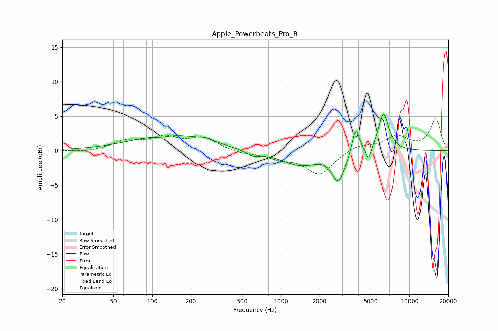

# Apple_Powerbeats_Pro_R
See [usage instructions](https://github.com/jaakkopasanen/AutoEq#usage) for more options and info.

### Parametric EQs
Apply preamp of -5.3 dB when using parametric equalizer.

|   # | Type    |   Fc (Hz) |    Q |   Gain (dB) |
|-----|---------|-----------|------|-------------|
|   1 | Peaking |       119 | 2.25 |        -0.3 |
|   2 | Peaking |       139 | 0.49 |         2.4 |
|   3 | Peaking |       263 | 2.97 |         0.4 |
|   4 | Peaking |       611 | 2.32 |        -0.8 |
|   5 | Peaking |      1403 | 0.98 |        -2.1 |
|   6 | Peaking |      2341 | 2.83 |         0.5 |
|   7 | Peaking |      2785 | 2.5  |        -4.4 |
|   8 | Peaking |      3819 | 4.79 |         4   |
|   9 | Peaking |      4816 | 5.99 |        -2.1 |
|  10 | Peaking |      6283 | 3.32 |         5.5 |

### Fixed Band EQs
When using fixed band (also called graphic) equalizer, apply preamp of **-4.7 dB** (if available) and set gains manually with these parameters.

|   # | Type    |   Fc (Hz) |    Q |   Gain (dB) |
|-----|---------|-----------|------|-------------|
|   1 | Peaking |        31 | 1.41 |        -0.3 |
|   2 | Peaking |        62 | 1.41 |         1.3 |
|   3 | Peaking |       125 | 1.41 |         1.7 |
|   4 | Peaking |       250 | 1.41 |         1.7 |
|   5 | Peaking |       500 | 1.41 |        -0.4 |
|   6 | Peaking |      1000 | 1.41 |        -1   |
|   7 | Peaking |      2000 | 1.41 |        -3.4 |
|   8 | Peaking |      4000 | 1.41 |         0.9 |
|   9 | Peaking |      8000 | 1.41 |         2   |
|  10 | Peaking |     16000 | 1.41 |         4.6 |

### Graphs

