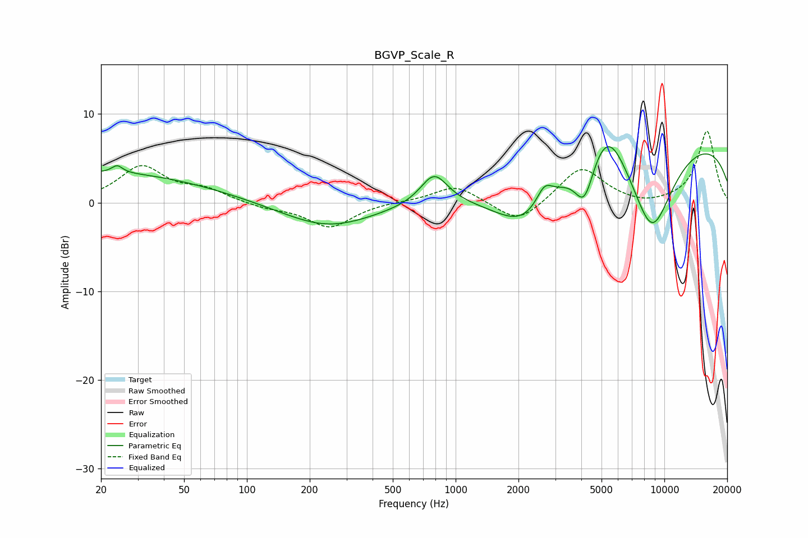

# BGVP_Scale_R
See [usage instructions](https://github.com/jaakkopasanen/AutoEq#usage) for more options and info.

### Parametric EQs
Apply preamp of -6.4 dB when using parametric equalizer.

|   # | Type    |   Fc (Hz) |    Q |   Gain (dB) |
|-----|---------|-----------|------|-------------|
|   1 | Peaking |        20 | 0.27 |         3.4 |
|   2 | Peaking |        24 | 5.64 |         0.8 |
|   3 | Peaking |       244 | 0.65 |        -2.8 |
|   4 | Peaking |       789 | 2.16 |         3.6 |
|   5 | Peaking |      2147 | 0.94 |        -5.2 |
|   6 | Peaking |      2661 | 3.66 |         2.1 |
|   7 | Peaking |      4140 | 3    |        -4.9 |
|   8 | Peaking |      5320 | 1.51 |         5.3 |
|   9 | Peaking |      8699 | 1.16 |       -10.9 |
|  10 | Peaking |     10000 | 0.2  |         7.9 |

### Fixed Band EQs
When using fixed band (also called graphic) equalizer, apply preamp of **-8.2 dB** (if available) and set gains manually with these parameters.

|   # | Type    |   Fc (Hz) |    Q |   Gain (dB) |
|-----|---------|-----------|------|-------------|
|   1 | Peaking |        31 | 1.41 |         4   |
|   2 | Peaking |        62 | 1.41 |         1.3 |
|   3 | Peaking |       125 | 1.41 |        -0.6 |
|   4 | Peaking |       250 | 1.41 |        -2.8 |
|   5 | Peaking |       500 | 1.41 |         0.1 |
|   6 | Peaking |      1000 | 1.41 |         2   |
|   7 | Peaking |      2000 | 1.41 |        -2.5 |
|   8 | Peaking |      4000 | 1.41 |         4.1 |
|   9 | Peaking |      8000 | 1.41 |        -0.5 |
|  10 | Peaking |     16000 | 1.41 |         8.1 |

### Graphs

