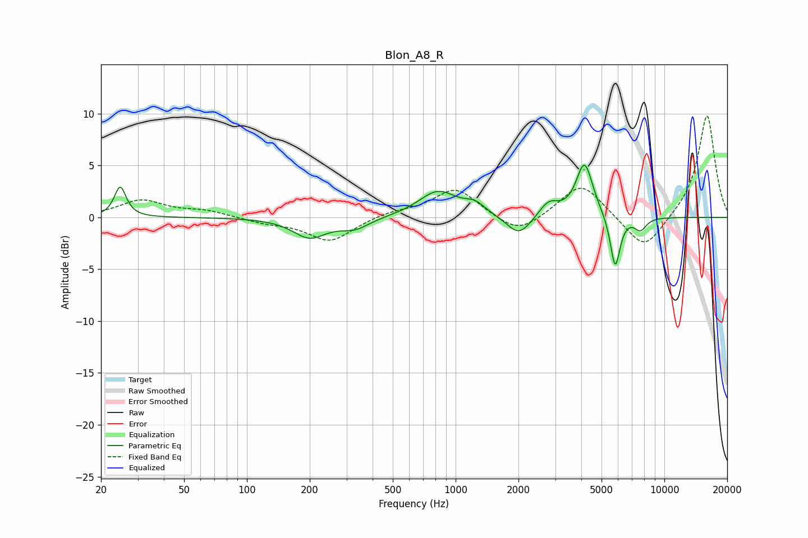

# Blon_A8_R
See [usage instructions](https://github.com/jaakkopasanen/AutoEq#usage) for more options and info.

### Parametric EQs
Apply preamp of -5.1 dB when using parametric equalizer.

|   # | Type    |   Fc (Hz) |    Q |   Gain (dB) |
|-----|---------|-----------|------|-------------|
|   1 | Peaking |        25 | 5.23 |         2.9 |
|   2 | Peaking |       200 | 1.77 |        -1.9 |
|   3 | Peaking |       329 | 1.98 |        -1   |
|   4 | Peaking |       823 | 1.55 |         2.5 |
|   5 | Peaking |      1238 | 2.84 |         0.9 |
|   6 | Peaking |      2013 | 2.42 |        -2   |
|   7 | Peaking |      2792 | 3.07 |         1.4 |
|   8 | Peaking |      4144 | 3.51 |         5.2 |
|   9 | Peaking |      5814 | 5.9  |        -5.1 |
|  10 | Peaking |      7674 | 4.72 |        -1.2 |

### Fixed Band EQs
When using fixed band (also called graphic) equalizer, apply preamp of **-9.9 dB** (if available) and set gains manually with these parameters.

|   # | Type    |   Fc (Hz) |    Q |   Gain (dB) |
|-----|---------|-----------|------|-------------|
|   1 | Peaking |        31 | 1.41 |         1.6 |
|   2 | Peaking |        62 | 1.41 |         0.6 |
|   3 | Peaking |       125 | 1.41 |        -0.5 |
|   4 | Peaking |       250 | 1.41 |        -2.3 |
|   5 | Peaking |       500 | 1.41 |         0.5 |
|   6 | Peaking |      1000 | 1.41 |         2.8 |
|   7 | Peaking |      2000 | 1.41 |        -1.8 |
|   8 | Peaking |      4000 | 1.41 |         3.4 |
|   9 | Peaking |      8000 | 1.41 |        -3.4 |
|  10 | Peaking |     16000 | 1.41 |        10   |

### Graphs

