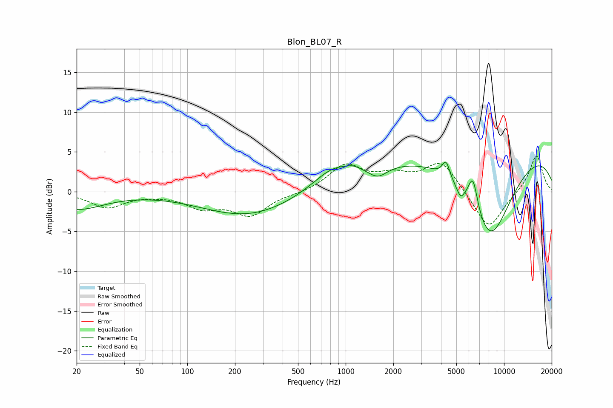

# Blon_BL07_R
See [usage instructions](https://github.com/jaakkopasanen/AutoEq#usage) for more options and info.

### Parametric EQs
Apply preamp of -3.8 dB when using parametric equalizer.

|   # | Type    |   Fc (Hz) |    Q |   Gain (dB) |
|-----|---------|-----------|------|-------------|
|   1 | Peaking |        20 | 0.82 |        -2.2 |
|   2 | Peaking |       240 | 0.49 |        -3.1 |
|   3 | Peaking |       832 | 1.09 |         2.5 |
|   4 | Peaking |      1122 | 3.21 |         0.5 |
|   5 | Peaking |      1598 | 2.54 |        -1.2 |
|   6 | Peaking |      4303 | 6    |         2.1 |
|   7 | Peaking |      5316 | 5.76 |        -1.3 |
|   8 | Peaking |      6367 | 4.49 |         4.2 |
|   9 | Peaking |      8130 | 0.81 |       -12.3 |
|  10 | Peaking |      8190 | 0.18 |         6.9 |

### Fixed Band EQs
When using fixed band (also called graphic) equalizer, apply preamp of **-4.6 dB** (if available) and set gains manually with these parameters.

|   # | Type    |   Fc (Hz) |    Q |   Gain (dB) |
|-----|---------|-----------|------|-------------|
|   1 | Peaking |        31 | 1.41 |        -1.9 |
|   2 | Peaking |        62 | 1.41 |        -0.2 |
|   3 | Peaking |       125 | 1.41 |        -1.8 |
|   4 | Peaking |       250 | 1.41 |        -2.8 |
|   5 | Peaking |       500 | 1.41 |        -0.2 |
|   6 | Peaking |      1000 | 1.41 |         3.2 |
|   7 | Peaking |      2000 | 1.41 |         1.6 |
|   8 | Peaking |      4000 | 1.41 |         3.8 |
|   9 | Peaking |      8000 | 1.41 |        -4.9 |
|  10 | Peaking |     16000 | 1.41 |         4.7 |

### Graphs

