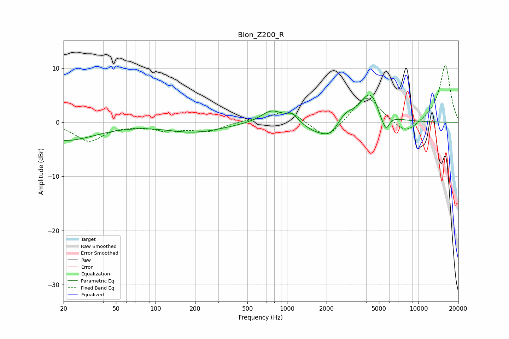

# Blon_Z200_R
See [usage instructions](https://github.com/jaakkopasanen/AutoEq#usage) for more options and info.

### Parametric EQs
Apply preamp of -5.1 dB when using parametric equalizer.

|   # | Type    |   Fc (Hz) |    Q |   Gain (dB) |
|-----|---------|-----------|------|-------------|
|   1 | Peaking |        20 | 0.59 |        -3.3 |
|   2 | Peaking |       199 | 0.65 |        -1.8 |
|   3 | Peaking |       765 | 1.72 |         2.4 |
|   4 | Peaking |      1093 | 3.37 |         1.4 |
|   5 | Peaking |      1593 | 1.71 |        -1.1 |
|   6 | Peaking |      2127 | 1.74 |        -2.8 |
|   7 | Peaking |      2757 | 2.3  |         1.9 |
|   8 | Peaking |      4292 | 1.83 |         5.6 |
|   9 | Peaking |      5183 | 4.46 |        -1.4 |
|  10 | Peaking |      5675 | 5.18 |        -2.6 |

### Fixed Band EQs
When using fixed band (also called graphic) equalizer, apply preamp of **-10.6 dB** (if available) and set gains manually with these parameters.

|   # | Type    |   Fc (Hz) |    Q |   Gain (dB) |
|-----|---------|-----------|------|-------------|
|   1 | Peaking |        31 | 1.41 |        -3.4 |
|   2 | Peaking |        62 | 1.41 |        -0.3 |
|   3 | Peaking |       125 | 1.41 |        -1.4 |
|   4 | Peaking |       250 | 1.41 |        -1.6 |
|   5 | Peaking |       500 | 1.41 |         0.3 |
|   6 | Peaking |      1000 | 1.41 |         2.4 |
|   7 | Peaking |      2000 | 1.41 |        -3.4 |
|   8 | Peaking |      4000 | 1.41 |         5.2 |
|   9 | Peaking |      8000 | 1.41 |        -2.6 |
|  10 | Peaking |     16000 | 1.41 |        10.7 |

### Graphs

