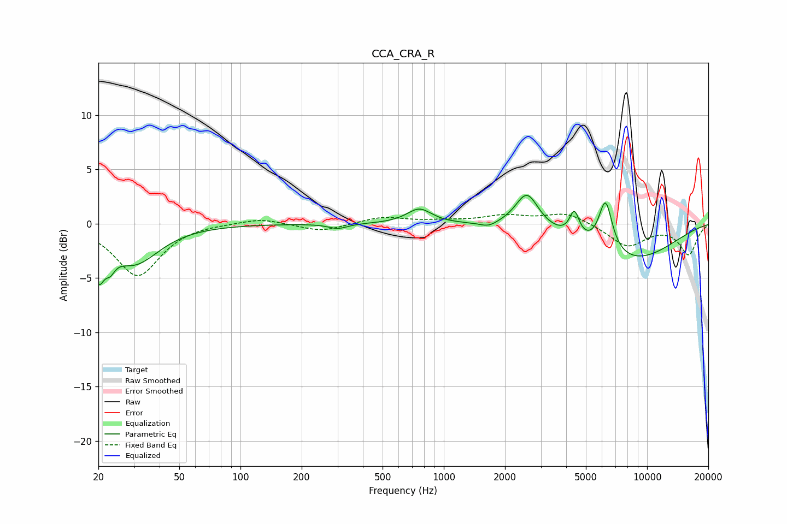

# CCA_CRA_R
See [usage instructions](https://github.com/jaakkopasanen/AutoEq#usage) for more options and info.

### Parametric EQs
Apply preamp of -2.7 dB when using parametric equalizer.

|   # | Type    |   Fc (Hz) |    Q |   Gain (dB) |
|-----|---------|-----------|------|-------------|
|   1 | Peaking |        20 | 5.34 |        -3.4 |
|   2 | Peaking |        23 | 5.92 |        -1.3 |
|   3 | Peaking |        30 | 1.17 |        -3.6 |
|   4 | Peaking |       302 | 3.04 |        -0.5 |
|   5 | Peaking |       758 | 2.34 |         1.4 |
|   6 | Peaking |      1658 | 3.45 |        -0.4 |
|   7 | Peaking |      2566 | 2.48 |         3.3 |
|   8 | Peaking |      4388 | 5.96 |         2.3 |
|   9 | Peaking |      6247 | 4.09 |         4.7 |
|  10 | Peaking |      8231 | 0.56 |        -3.4 |

### Fixed Band EQs
When using fixed band (also called graphic) equalizer, apply preamp of **-1.0 dB** (if available) and set gains manually with these parameters.

|   # | Type    |   Fc (Hz) |    Q |   Gain (dB) |
|-----|---------|-----------|------|-------------|
|   1 | Peaking |        31 | 1.41 |        -4.8 |
|   2 | Peaking |        62 | 1.41 |         0.1 |
|   3 | Peaking |       125 | 1.41 |         0.5 |
|   4 | Peaking |       250 | 1.41 |        -0.7 |
|   5 | Peaking |       500 | 1.41 |         0.6 |
|   6 | Peaking |      1000 | 1.41 |         0.2 |
|   7 | Peaking |      2000 | 1.41 |         0.7 |
|   8 | Peaking |      4000 | 1.41 |         1   |
|   9 | Peaking |      8000 | 1.41 |        -2.1 |
|  10 | Peaking |     16000 | 1.41 |        -2.8 |

### Graphs

