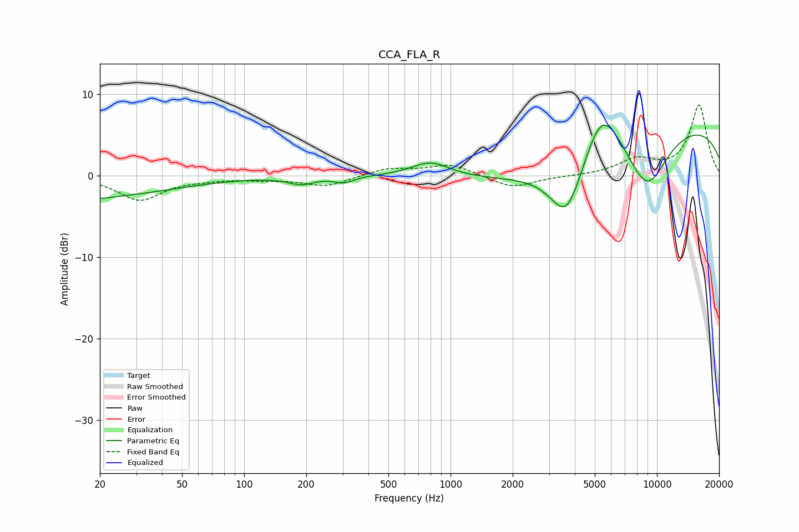

# CCA_FLA_R
See [usage instructions](https://github.com/jaakkopasanen/AutoEq#usage) for more options and info.

### Parametric EQs
Apply preamp of -6.3 dB when using parametric equalizer.

|   # | Type    |   Fc (Hz) |    Q |   Gain (dB) |
|-----|---------|-----------|------|-------------|
|   1 | Peaking |        20 | 0.41 |        -2.5 |
|   2 | Peaking |        21 | 3.29 |        -0.3 |
|   3 | Peaking |       189 | 2.33 |        -0.9 |
|   4 | Peaking |       305 | 2.99 |        -0.8 |
|   5 | Peaking |       797 | 1.57 |         1.8 |
|   6 | Peaking |      2249 | 0.56 |        -2.3 |
|   7 | Peaking |      3661 | 1.59 |        -8.4 |
|   8 | Peaking |      5397 | 1.55 |         6.3 |
|   9 | Peaking |      8949 | 1.21 |        -7.7 |
|  10 | Peaking |     10000 | 0.19 |         6.7 |

### Fixed Band EQs
When using fixed band (also called graphic) equalizer, apply preamp of **-8.8 dB** (if available) and set gains manually with these parameters.

|   # | Type    |   Fc (Hz) |    Q |   Gain (dB) |
|-----|---------|-----------|------|-------------|
|   1 | Peaking |        31 | 1.41 |        -2.9 |
|   2 | Peaking |        62 | 1.41 |        -0.3 |
|   3 | Peaking |       125 | 1.41 |        -0.3 |
|   4 | Peaking |       250 | 1.41 |        -1.3 |
|   5 | Peaking |       500 | 1.41 |         0.9 |
|   6 | Peaking |      1000 | 1.41 |         1.4 |
|   7 | Peaking |      2000 | 1.41 |        -1.5 |
|   8 | Peaking |      4000 | 1.41 |        -0   |
|   9 | Peaking |      8000 | 1.41 |         1.9 |
|  10 | Peaking |     16000 | 1.41 |         8.6 |

### Graphs

