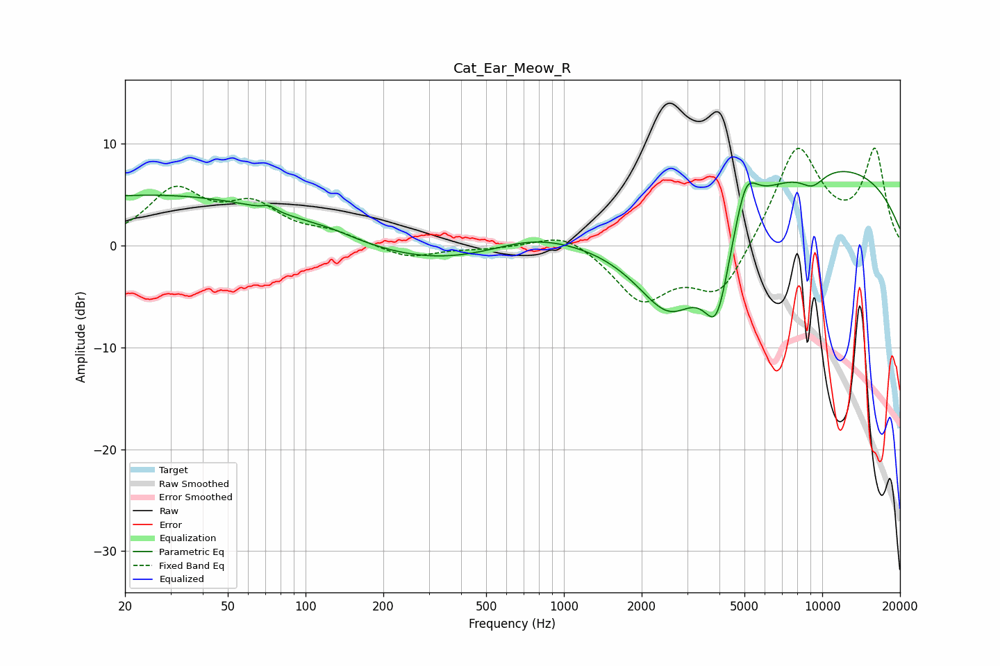

# Cat_Ear_Meow_R
See [usage instructions](https://github.com/jaakkopasanen/AutoEq#usage) for more options and info.

### Parametric EQs
Apply preamp of -7.4 dB when using parametric equalizer.

|   # | Type    |   Fc (Hz) |    Q |   Gain (dB) |
|-----|---------|-----------|------|-------------|
|   1 | Peaking |        26 | 0.22 |         5   |
|   2 | Peaking |        72 | 5.99 |         0.5 |
|   3 | Peaking |       126 | 1.65 |         0.3 |
|   4 | Peaking |       322 | 0.42 |        -2.2 |
|   5 | Peaking |       743 | 0.82 |         1.5 |
|   6 | Peaking |      2584 | 0.83 |       -12.1 |
|   7 | Peaking |      3908 | 2.61 |        -8.2 |
|   8 | Peaking |      5049 | 3.13 |         4.5 |
|   9 | Peaking |      7313 | 0.19 |         8.9 |
|  10 | Peaking |      9168 | 2.61 |        -1.5 |

### Fixed Band EQs
When using fixed band (also called graphic) equalizer, apply preamp of **-9.7 dB** (if available) and set gains manually with these parameters.

|   # | Type    |   Fc (Hz) |    Q |   Gain (dB) |
|-----|---------|-----------|------|-------------|
|   1 | Peaking |        31 | 1.41 |         5.1 |
|   2 | Peaking |        62 | 1.41 |         3.5 |
|   3 | Peaking |       125 | 1.41 |         1   |
|   4 | Peaking |       250 | 1.41 |        -1.3 |
|   5 | Peaking |       500 | 1.41 |        -0.3 |
|   6 | Peaking |      1000 | 1.41 |         1.6 |
|   7 | Peaking |      2000 | 1.41 |        -5.2 |
|   8 | Peaking |      4000 | 1.41 |        -5.1 |
|   9 | Peaking |      8000 | 1.41 |         9.9 |
|  10 | Peaking |     16000 | 1.41 |         9.1 |

### Graphs

