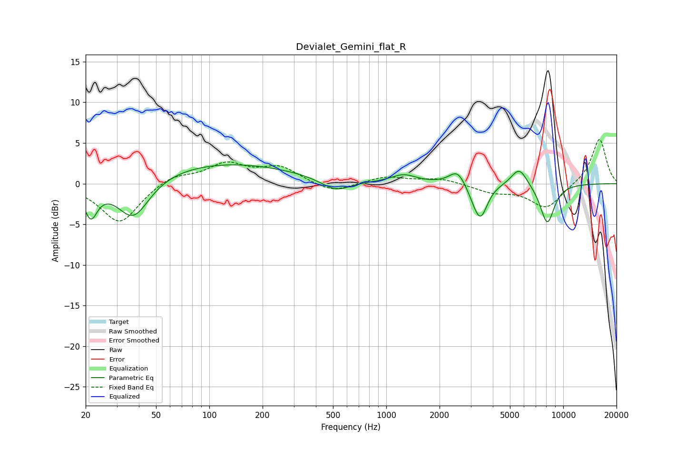

# Devialet_Gemini_flat_R
See [usage instructions](https://github.com/jaakkopasanen/AutoEq#usage) for more options and info.

### Parametric EQs
Apply preamp of -2.4 dB when using parametric equalizer.

|   # | Type    |   Fc (Hz) |    Q |   Gain (dB) |
|-----|---------|-----------|------|-------------|
|   1 | Peaking |        21 | 3.84 |        -3.8 |
|   2 | Peaking |        37 | 1.56 |        -5   |
|   3 | Peaking |       119 | 0.34 |         2.6 |
|   4 | Peaking |       518 | 1.68 |        -1.5 |
|   5 | Peaking |      1253 | 2.01 |         1   |
|   6 | Peaking |      2528 | 3.06 |         1.9 |
|   7 | Peaking |      3168 | 3.38 |        -1.2 |
|   8 | Peaking |      3426 | 3.7  |        -3.6 |
|   9 | Peaking |      5640 | 3.06 |         2.3 |
|  10 | Peaking |      8125 | 3.23 |        -4.9 |

### Fixed Band EQs
When using fixed band (also called graphic) equalizer, apply preamp of **-5.5 dB** (if available) and set gains manually with these parameters.

|   # | Type    |   Fc (Hz) |    Q |   Gain (dB) |
|-----|---------|-----------|------|-------------|
|   1 | Peaking |        31 | 1.41 |        -4.9 |
|   2 | Peaking |        62 | 1.41 |         1.1 |
|   3 | Peaking |       125 | 1.41 |         2.3 |
|   4 | Peaking |       250 | 1.41 |         1.9 |
|   5 | Peaking |       500 | 1.41 |        -1.2 |
|   6 | Peaking |      1000 | 1.41 |         0.9 |
|   7 | Peaking |      2000 | 1.41 |         0.6 |
|   8 | Peaking |      4000 | 1.41 |        -1   |
|   9 | Peaking |      8000 | 1.41 |        -3   |
|  10 | Peaking |     16000 | 1.41 |         5.6 |

### Graphs

