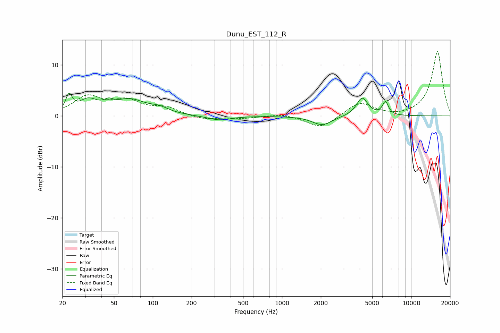

# Dunu_EST_112_R
See [usage instructions](https://github.com/jaakkopasanen/AutoEq#usage) for more options and info.

### Parametric EQs
Apply preamp of -4.6 dB when using parametric equalizer.

|   # | Type    |   Fc (Hz) |    Q |   Gain (dB) |
|-----|---------|-----------|------|-------------|
|   1 | Peaking |        22 | 5.83 |         3.2 |
|   2 | Peaking |        32 | 2    |         2.6 |
|   3 | Peaking |        45 | 5.47 |        -2.5 |
|   4 | Peaking |        45 | 4.96 |         3.6 |
|   5 | Peaking |        66 | 1.18 |         2.9 |
|   6 | Peaking |       112 | 1.95 |         1   |
|   7 | Peaking |       326 | 1.58 |        -0.9 |
|   8 | Peaking |      2049 | 1.86 |        -1.8 |
|   9 | Peaking |      4179 | 3.2  |         3.6 |
|  10 | Peaking |      6333 | 5.99 |         2.6 |

### Fixed Band EQs
When using fixed band (also called graphic) equalizer, apply preamp of **-12.7 dB** (if available) and set gains manually with these parameters.

|   # | Type    |   Fc (Hz) |    Q |   Gain (dB) |
|-----|---------|-----------|------|-------------|
|   1 | Peaking |        31 | 1.41 |         3.6 |
|   2 | Peaking |        62 | 1.41 |         2.6 |
|   3 | Peaking |       125 | 1.41 |         1.5 |
|   4 | Peaking |       250 | 1.41 |        -0.8 |
|   5 | Peaking |       500 | 1.41 |        -0.4 |
|   6 | Peaking |      1000 | 1.41 |         0.5 |
|   7 | Peaking |      2000 | 1.41 |        -2.5 |
|   8 | Peaking |      4000 | 1.41 |         2.7 |
|   9 | Peaking |      8000 | 1.41 |        -0.3 |
|  10 | Peaking |     16000 | 1.41 |        12.7 |

### Graphs

