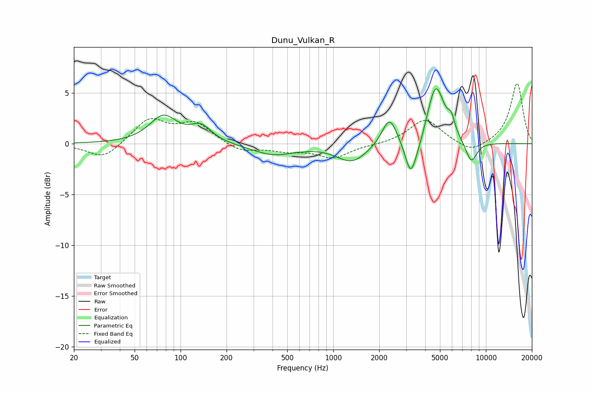

# Dunu_Vulkan_R
See [usage instructions](https://github.com/jaakkopasanen/AutoEq#usage) for more options and info.

### Parametric EQs
Apply preamp of -5.5 dB when using parametric equalizer.

|   # | Type    |   Fc (Hz) |    Q |   Gain (dB) |
|-----|---------|-----------|------|-------------|
|   1 | Peaking |        77 | 1.57 |         2.6 |
|   2 | Peaking |       136 | 2.08 |         1.5 |
|   3 | Peaking |       406 | 1.01 |        -1.1 |
|   4 | Peaking |      1328 | 1.41 |        -1.8 |
|   5 | Peaking |      2335 | 2.92 |         2.8 |
|   6 | Peaking |      3212 | 3.87 |        -3.4 |
|   7 | Peaking |      3638 | 2.95 |        -1   |
|   8 | Peaking |      4690 | 2.44 |         5.9 |
|   9 | Peaking |      5933 | 6    |         1.3 |
|  10 | Peaking |      8010 | 3.46 |        -2.1 |

### Fixed Band EQs
When using fixed band (also called graphic) equalizer, apply preamp of **-6.0 dB** (if available) and set gains manually with these parameters.

|   # | Type    |   Fc (Hz) |    Q |   Gain (dB) |
|-----|---------|-----------|------|-------------|
|   1 | Peaking |        31 | 1.41 |        -1.6 |
|   2 | Peaking |        62 | 1.41 |         2.4 |
|   3 | Peaking |       125 | 1.41 |         1.9 |
|   4 | Peaking |       250 | 1.41 |        -0.8 |
|   5 | Peaking |       500 | 1.41 |        -0.6 |
|   6 | Peaking |      1000 | 1.41 |        -1.3 |
|   7 | Peaking |      2000 | 1.41 |        -0.1 |
|   8 | Peaking |      4000 | 1.41 |         2.4 |
|   9 | Peaking |      8000 | 1.41 |        -1   |
|  10 | Peaking |     16000 | 1.41 |         6   |

### Graphs

