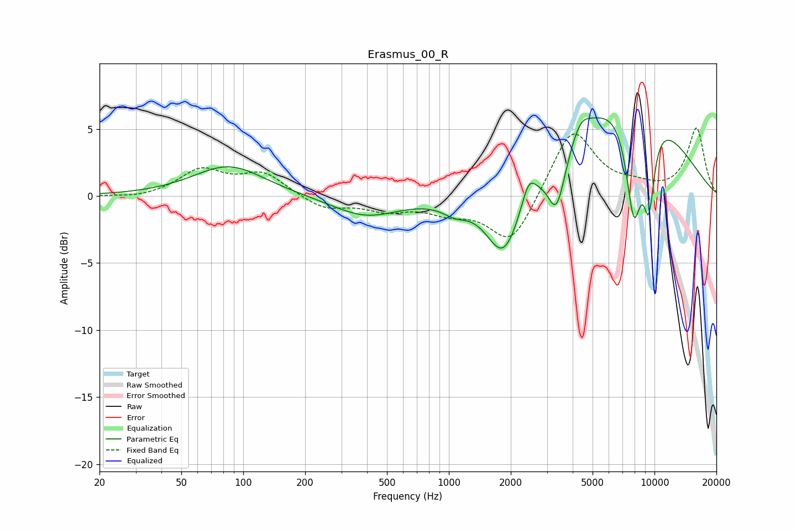

# Erasmus_00_R
See [usage instructions](https://github.com/jaakkopasanen/AutoEq#usage) for more options and info.

### Parametric EQs
Apply preamp of -5.9 dB when using parametric equalizer.

|   # | Type    |   Fc (Hz) |    Q |   Gain (dB) |
|-----|---------|-----------|------|-------------|
|   1 | Peaking |        85 | 0.83 |         2.3 |
|   2 | Peaking |       395 | 0.86 |        -1.5 |
|   3 | Peaking |      1073 | 2.18 |        -0.8 |
|   4 | Peaking |      1848 | 1.64 |        -5.4 |
|   5 | Peaking |      2446 | 4.27 |         1.7 |
|   6 | Peaking |      3342 | 3.32 |        -4   |
|   7 | Peaking |      4370 | 3.04 |         1.4 |
|   8 | Peaking |      7320 | 0.47 |         7.8 |
|   9 | Peaking |      7932 | 3.23 |        -8.1 |
|  10 | Peaking |      9390 | 4.54 |        -5.7 |

### Fixed Band EQs
When using fixed band (also called graphic) equalizer, apply preamp of **-5.2 dB** (if available) and set gains manually with these parameters.

|   # | Type    |   Fc (Hz) |    Q |   Gain (dB) |
|-----|---------|-----------|------|-------------|
|   1 | Peaking |        31 | 1.41 |        -0.2 |
|   2 | Peaking |        62 | 1.41 |         1.9 |
|   3 | Peaking |       125 | 1.41 |         1.6 |
|   4 | Peaking |       250 | 1.41 |        -1   |
|   5 | Peaking |       500 | 1.41 |        -0.9 |
|   6 | Peaking |      1000 | 1.41 |        -1   |
|   7 | Peaking |      2000 | 1.41 |        -3.7 |
|   8 | Peaking |      4000 | 1.41 |         5.2 |
|   9 | Peaking |      8000 | 1.41 |         0.6 |
|  10 | Peaking |     16000 | 1.41 |         5   |

### Graphs

