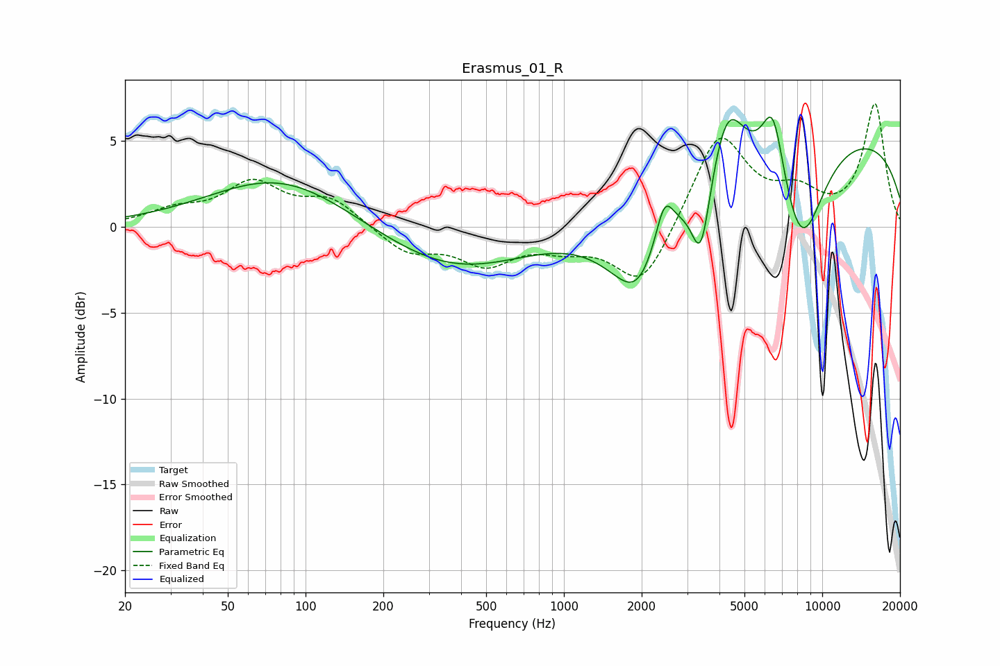

# Erasmus_01_R
See [usage instructions](https://github.com/jaakkopasanen/AutoEq#usage) for more options and info.

### Parametric EQs
Apply preamp of -6.5 dB when using parametric equalizer.

|   # | Type    |   Fc (Hz) |    Q |   Gain (dB) |
|-----|---------|-----------|------|-------------|
|   1 | Peaking |        80 | 0.52 |         3   |
|   2 | Peaking |       376 | 0.5  |        -2.5 |
|   3 | Peaking |      1895 | 2.39 |        -0.7 |
|   4 | Peaking |      1959 | 1.05 |        -5.1 |
|   5 | Peaking |      2448 | 3.99 |         2.6 |
|   6 | Peaking |      3393 | 3.8  |        -4.6 |
|   7 | Peaking |      4283 | 2.21 |         3.9 |
|   8 | Peaking |      6447 | 3.18 |         4.2 |
|   9 | Peaking |      8282 | 1.43 |        -6.5 |
|  10 | Peaking |      9549 | 0.19 |         5.7 |

### Fixed Band EQs
When using fixed band (also called graphic) equalizer, apply preamp of **-7.3 dB** (if available) and set gains manually with these parameters.

|   # | Type    |   Fc (Hz) |    Q |   Gain (dB) |
|-----|---------|-----------|------|-------------|
|   1 | Peaking |        31 | 1.41 |         0.8 |
|   2 | Peaking |        62 | 1.41 |         2.4 |
|   3 | Peaking |       125 | 1.41 |         1.5 |
|   4 | Peaking |       250 | 1.41 |        -1.5 |
|   5 | Peaking |       500 | 1.41 |        -2   |
|   6 | Peaking |      1000 | 1.41 |        -0.9 |
|   7 | Peaking |      2000 | 1.41 |        -3.6 |
|   8 | Peaking |      4000 | 1.41 |         5.5 |
|   9 | Peaking |      8000 | 1.41 |         1.6 |
|  10 | Peaking |     16000 | 1.41 |         7.1 |

### Graphs

