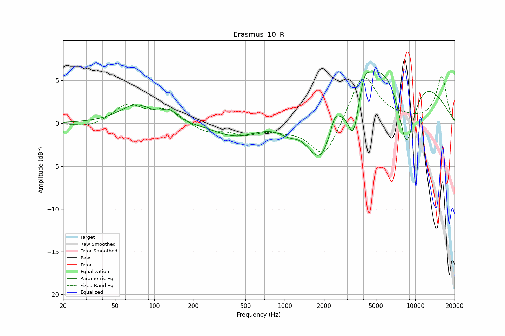

# Erasmus_10_R
See [usage instructions](https://github.com/jaakkopasanen/AutoEq#usage) for more options and info.

### Parametric EQs
Apply preamp of -6.1 dB when using parametric equalizer.

|   # | Type    |   Fc (Hz) |    Q |   Gain (dB) |
|-----|---------|-----------|------|-------------|
|   1 | Peaking |        72 | 1.16 |         2.1 |
|   2 | Peaking |       130 | 2.48 |         1.2 |
|   3 | Peaking |       419 | 0.88 |        -1.6 |
|   4 | Peaking |      1066 | 2.02 |        -0.9 |
|   5 | Peaking |      1878 | 1.36 |        -6.8 |
|   6 | Peaking |      2422 | 4.58 |         1.5 |
|   7 | Peaking |      3360 | 3.18 |        -5.7 |
|   8 | Peaking |      4069 | 3.84 |         1.8 |
|   9 | Peaking |      6578 | 0.36 |         9.3 |
|  10 | Peaking |      8537 | 1.72 |       -10.4 |

### Fixed Band EQs
When using fixed band (also called graphic) equalizer, apply preamp of **-5.6 dB** (if available) and set gains manually with these parameters.

|   # | Type    |   Fc (Hz) |    Q |   Gain (dB) |
|-----|---------|-----------|------|-------------|
|   1 | Peaking |        31 | 1.41 |        -0.5 |
|   2 | Peaking |        62 | 1.41 |         2.1 |
|   3 | Peaking |       125 | 1.41 |         1.6 |
|   4 | Peaking |       250 | 1.41 |        -1   |
|   5 | Peaking |       500 | 1.41 |        -1.1 |
|   6 | Peaking |      1000 | 1.41 |        -0.5 |
|   7 | Peaking |      2000 | 1.41 |        -4.2 |
|   8 | Peaking |      4000 | 1.41 |         6   |
|   9 | Peaking |      8000 | 1.41 |         0.4 |
|  10 | Peaking |     16000 | 1.41 |         5.4 |

### Graphs

