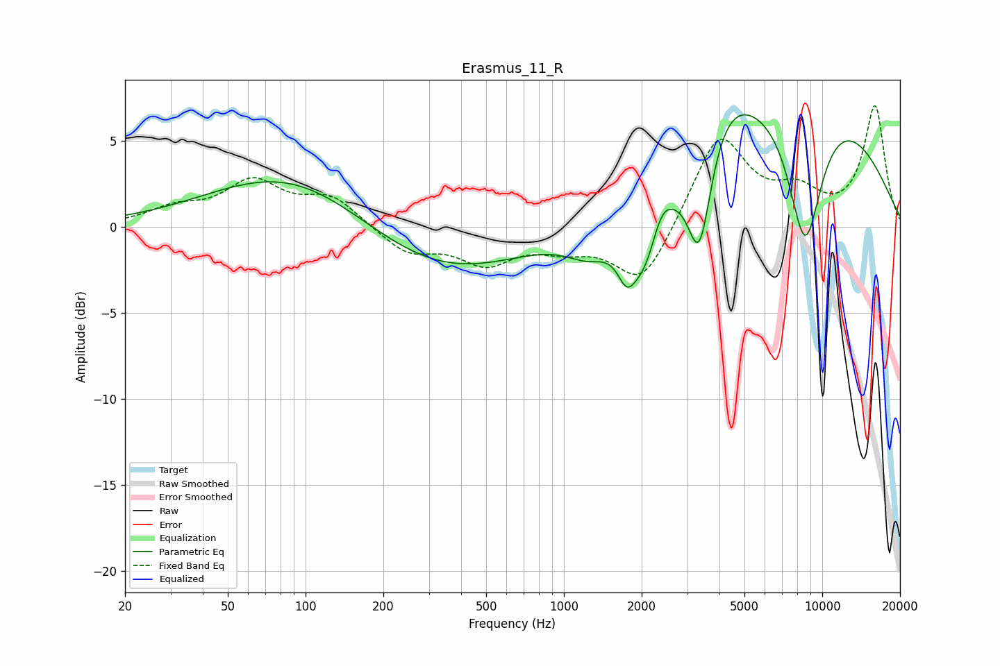

# Erasmus_11_R
See [usage instructions](https://github.com/jaakkopasanen/AutoEq#usage) for more options and info.

### Parametric EQs
Apply preamp of -6.6 dB when using parametric equalizer.

|   # | Type    |   Fc (Hz) |    Q |   Gain (dB) |
|-----|---------|-----------|------|-------------|
|   1 | Peaking |        89 | 0.46 |         3.4 |
|   2 | Peaking |       330 | 0.44 |        -3   |
|   3 | Peaking |      1251 | 1.54 |        -1.6 |
|   4 | Peaking |      1748 | 3.89 |        -1.9 |
|   5 | Peaking |      2073 | 2.01 |        -4.2 |
|   6 | Peaking |      2370 | 3.36 |         1.7 |
|   7 | Peaking |      3349 | 2.96 |        -6.6 |
|   8 | Peaking |      4104 | 1.24 |         2.7 |
|   9 | Peaking |      8060 | 0.34 |         8.2 |
|  10 | Peaking |      8577 | 1.85 |        -8.9 |

### Fixed Band EQs
When using fixed band (also called graphic) equalizer, apply preamp of **-7.1 dB** (if available) and set gains manually with these parameters.

|   # | Type    |   Fc (Hz) |    Q |   Gain (dB) |
|-----|---------|-----------|------|-------------|
|   1 | Peaking |        31 | 1.41 |         0.9 |
|   2 | Peaking |        62 | 1.41 |         2.5 |
|   3 | Peaking |       125 | 1.41 |         1.7 |
|   4 | Peaking |       250 | 1.41 |        -1.5 |
|   5 | Peaking |       500 | 1.41 |        -1.9 |
|   6 | Peaking |      1000 | 1.41 |        -0.9 |
|   7 | Peaking |      2000 | 1.41 |        -3.5 |
|   8 | Peaking |      4000 | 1.41 |         5.4 |
|   9 | Peaking |      8000 | 1.41 |         1.7 |
|  10 | Peaking |     16000 | 1.41 |         6.9 |

### Graphs

