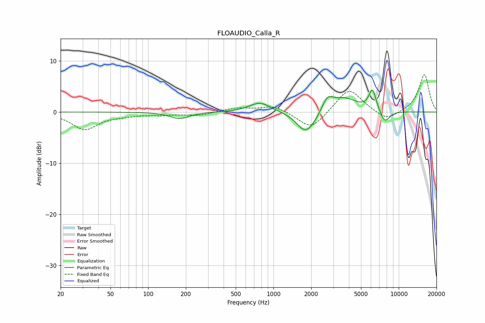

# FLOAUDIO_Calla_R
See [usage instructions](https://github.com/jaakkopasanen/AutoEq#usage) for more options and info.

### Parametric EQs
Apply preamp of -4.4 dB when using parametric equalizer.

|   # | Type    |   Fc (Hz) |    Q |   Gain (dB) |
|-----|---------|-----------|------|-------------|
|   1 | Peaking |       178 | 1.86 |        -1.3 |
|   2 | Peaking |       782 | 1.65 |         1.9 |
|   3 | Peaking |      1796 | 2.01 |        -3.8 |
|   4 | Peaking |      2200 | 1.77 |        -1.2 |
|   5 | Peaking |      2504 | 2.44 |         0.5 |
|   6 | Peaking |      2698 | 3.12 |         2.4 |
|   7 | Peaking |      3655 | 1.31 |         2.7 |
|   8 | Peaking |      6174 | 4.66 |         4.1 |
|   9 | Peaking |      7724 | 3.21 |        -1.7 |
|  10 | Peaking |      7751 | 3.85 |        -0.8 |

### Fixed Band EQs
When using fixed band (also called graphic) equalizer, apply preamp of **-7.4 dB** (if available) and set gains manually with these parameters.

|   # | Type    |   Fc (Hz) |    Q |   Gain (dB) |
|-----|---------|-----------|------|-------------|
|   1 | Peaking |        31 | 1.41 |        -3.3 |
|   2 | Peaking |        62 | 1.41 |        -0.5 |
|   3 | Peaking |       125 | 1.41 |        -0.4 |
|   4 | Peaking |       250 | 1.41 |        -0.7 |
|   5 | Peaking |       500 | 1.41 |         0.8 |
|   6 | Peaking |      1000 | 1.41 |         1.3 |
|   7 | Peaking |      2000 | 1.41 |        -3.6 |
|   8 | Peaking |      4000 | 1.41 |         4.8 |
|   9 | Peaking |      8000 | 1.41 |        -1.9 |
|  10 | Peaking |     16000 | 1.41 |         7.4 |

### Graphs

