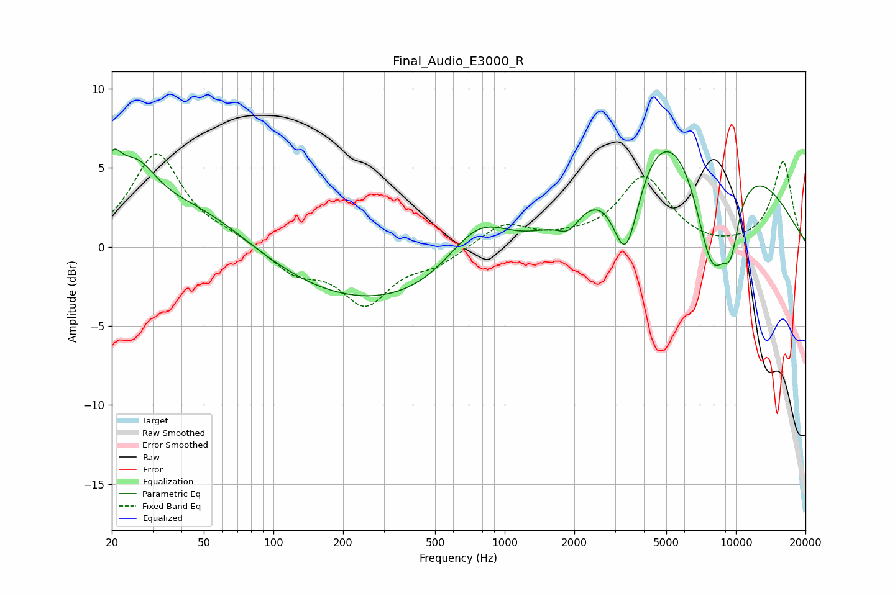

# Final_Audio_E3000_R
See [usage instructions](https://github.com/jaakkopasanen/AutoEq#usage) for more options and info.

### Parametric EQs
Apply preamp of -6.3 dB when using parametric equalizer.

|   # | Type    |   Fc (Hz) |    Q |   Gain (dB) |
|-----|---------|-----------|------|-------------|
|   1 | Peaking |        20 | 3.81 |         2.7 |
|   2 | Peaking |        25 | 1.52 |         3.6 |
|   3 | Peaking |        47 | 0.59 |         2.7 |
|   4 | Peaking |       458 | 0.2  |        -4.3 |
|   5 | Peaking |       773 | 0.96 |         3.9 |
|   6 | Peaking |      1891 | 2.93 |        -1.2 |
|   7 | Peaking |      3348 | 2.35 |        -6.4 |
|   8 | Peaking |      6016 | 0.38 |        11.8 |
|   9 | Peaking |      7878 | 1.39 |       -10.8 |
|  10 | Peaking |      9511 | 3.66 |        -2.9 |

### Fixed Band EQs
When using fixed band (also called graphic) equalizer, apply preamp of **-6.0 dB** (if available) and set gains manually with these parameters.

|   # | Type    |   Fc (Hz) |    Q |   Gain (dB) |
|-----|---------|-----------|------|-------------|
|   1 | Peaking |        31 | 1.41 |         5.8 |
|   2 | Peaking |        62 | 1.41 |         0.5 |
|   3 | Peaking |       125 | 1.41 |        -1.5 |
|   4 | Peaking |       250 | 1.41 |        -3.4 |
|   5 | Peaking |       500 | 1.41 |        -1   |
|   6 | Peaking |      1000 | 1.41 |         1.5 |
|   7 | Peaking |      2000 | 1.41 |         0.3 |
|   8 | Peaking |      4000 | 1.41 |         4.3 |
|   9 | Peaking |      8000 | 1.41 |        -0.2 |
|  10 | Peaking |     16000 | 1.41 |         5.4 |

### Graphs

