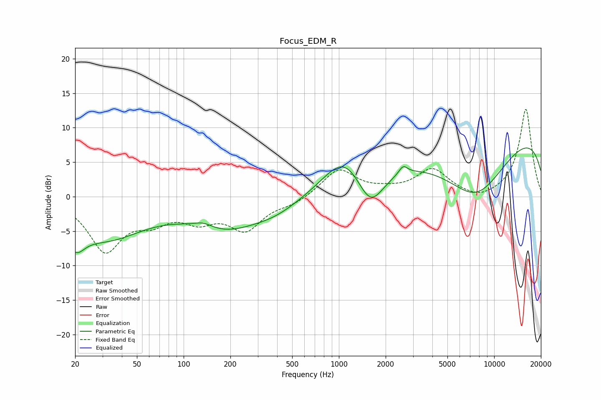

# Focus_EDM_R
See [usage instructions](https://github.com/jaakkopasanen/AutoEq#usage) for more options and info.

### Parametric EQs
Apply preamp of -7.2 dB when using parametric equalizer.

|   # | Type    |   Fc (Hz) |    Q |   Gain (dB) |
|-----|---------|-----------|------|-------------|
|   1 | Peaking |        20 | 2.49 |        -3.4 |
|   2 | Peaking |        31 | 0.56 |        -5.7 |
|   3 | Peaking |       134 | 2.43 |         0.8 |
|   4 | Peaking |       186 | 0.61 |        -4.1 |
|   5 | Peaking |       396 | 0.89 |        -1.5 |
|   6 | Peaking |      1082 | 1.09 |         5   |
|   7 | Peaking |      1595 | 1.61 |        -5.6 |
|   8 | Peaking |      2593 | 5.18 |         1.2 |
|   9 | Peaking |      7631 | 0.56 |       -10.5 |
|  10 | Peaking |      9875 | 0.18 |        11.4 |

### Fixed Band EQs
When using fixed band (also called graphic) equalizer, apply preamp of **-12.8 dB** (if available) and set gains manually with these parameters.

|   # | Type    |   Fc (Hz) |    Q |   Gain (dB) |
|-----|---------|-----------|------|-------------|
|   1 | Peaking |        31 | 1.41 |        -7.6 |
|   2 | Peaking |        62 | 1.41 |        -2.7 |
|   3 | Peaking |       125 | 1.41 |        -2.8 |
|   4 | Peaking |       250 | 1.41 |        -4.5 |
|   5 | Peaking |       500 | 1.41 |        -0.9 |
|   6 | Peaking |      1000 | 1.41 |         4   |
|   7 | Peaking |      2000 | 1.41 |         0.6 |
|   8 | Peaking |      4000 | 1.41 |         3.8 |
|   9 | Peaking |      8000 | 1.41 |        -0.8 |
|  10 | Peaking |     16000 | 1.41 |        12.8 |

### Graphs

