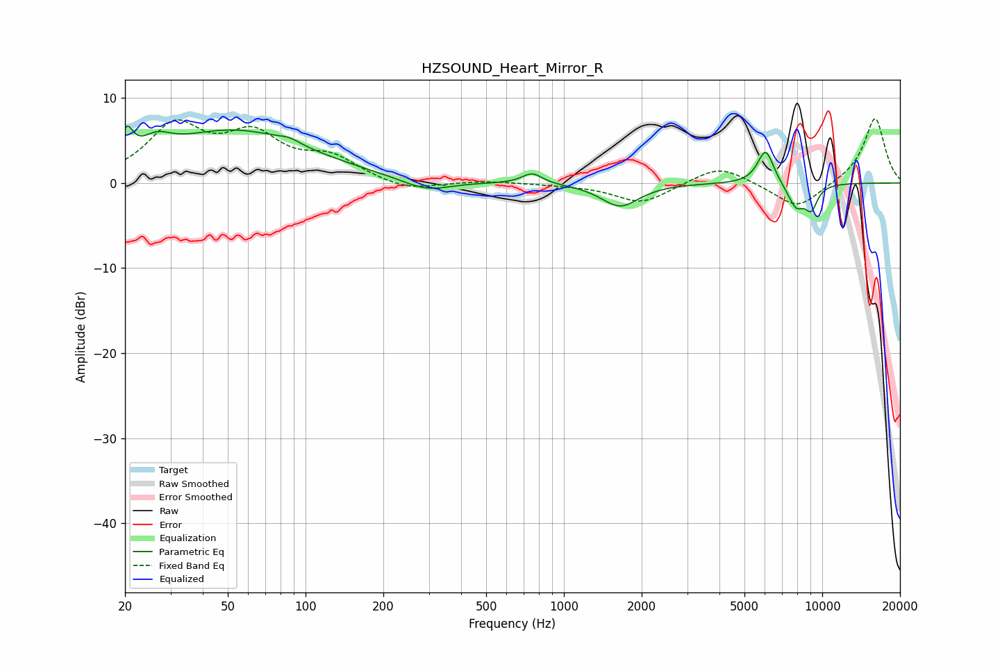

# HZSOUND_Heart_Mirror_R
See [usage instructions](https://github.com/jaakkopasanen/AutoEq#usage) for more options and info.

### Parametric EQs
Apply preamp of -6.8 dB when using parametric equalizer.

|   # | Type    |   Fc (Hz) |    Q |   Gain (dB) |
|-----|---------|-----------|------|-------------|
|   1 | Peaking |        20 | 5.99 |         3.2 |
|   2 | Peaking |        26 | 2.49 |         1.8 |
|   3 | Peaking |        53 | 0.49 |         6.1 |
|   4 | Peaking |        86 | 3.5  |         0.5 |
|   5 | Peaking |       293 | 1.49 |        -1.4 |
|   6 | Peaking |       754 | 3.65 |         1.3 |
|   7 | Peaking |      1650 | 1.93 |        -2.7 |
|   8 | Peaking |      6040 | 4.32 |         4.1 |
|   9 | Peaking |      7923 | 3.89 |        -2.8 |
|  10 | Peaking |      9075 | 5.21 |        -2.6 |

### Fixed Band EQs
When using fixed band (also called graphic) equalizer, apply preamp of **-7.6 dB** (if available) and set gains manually with these parameters.

|   # | Type    |   Fc (Hz) |    Q |   Gain (dB) |
|-----|---------|-----------|------|-------------|
|   1 | Peaking |        31 | 1.41 |         6.4 |
|   2 | Peaking |        62 | 1.41 |         4.9 |
|   3 | Peaking |       125 | 1.41 |         2.6 |
|   4 | Peaking |       250 | 1.41 |        -1.1 |
|   5 | Peaking |       500 | 1.41 |         0.3 |
|   6 | Peaking |      1000 | 1.41 |        -0.1 |
|   7 | Peaking |      2000 | 1.41 |        -2.4 |
|   8 | Peaking |      4000 | 1.41 |         2.2 |
|   9 | Peaking |      8000 | 1.41 |        -3.1 |
|  10 | Peaking |     16000 | 1.41 |         7.7 |

### Graphs

