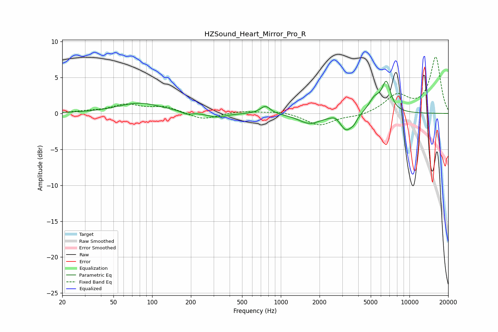

# HZSound_Heart_Mirror_Pro_R
See [usage instructions](https://github.com/jaakkopasanen/AutoEq#usage) for more options and info.

### Parametric EQs
Apply preamp of -4.6 dB when using parametric equalizer.

|   # | Type    |   Fc (Hz) |    Q |   Gain (dB) |
|-----|---------|-----------|------|-------------|
|   1 | Peaking |        80 | 0.83 |         1.4 |
|   2 | Peaking |       185 | 3.87 |        -0.4 |
|   3 | Peaking |       316 | 1.94 |        -0.6 |
|   4 | Peaking |       758 | 3.6  |         1.1 |
|   5 | Peaking |      1671 | 1.67 |        -1.4 |
|   6 | Peaking |      2653 | 4    |         0.5 |
|   7 | Peaking |      3226 | 2.87 |        -2.3 |
|   8 | Peaking |      3699 | 6    |        -0.6 |
|   9 | Peaking |      5348 | 2.92 |         1.8 |
|  10 | Peaking |      6615 | 3.87 |         4   |

### Fixed Band EQs
When using fixed band (also called graphic) equalizer, apply preamp of **-7.9 dB** (if available) and set gains manually with these parameters.

|   # | Type    |   Fc (Hz) |    Q |   Gain (dB) |
|-----|---------|-----------|------|-------------|
|   1 | Peaking |        31 | 1.41 |         0.2 |
|   2 | Peaking |        62 | 1.41 |         1.1 |
|   3 | Peaking |       125 | 1.41 |         0.9 |
|   4 | Peaking |       250 | 1.41 |        -0.9 |
|   5 | Peaking |       500 | 1.41 |         0.3 |
|   6 | Peaking |      1000 | 1.41 |         0.3 |
|   7 | Peaking |      2000 | 1.41 |        -1.7 |
|   8 | Peaking |      4000 | 1.41 |        -0.4 |
|   9 | Peaking |      8000 | 1.41 |         2.4 |
|  10 | Peaking |     16000 | 1.41 |         7.8 |

### Graphs

