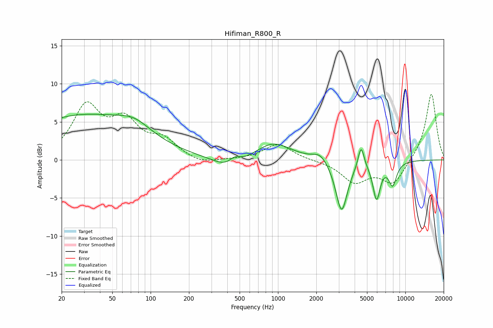

# Hifiman_R800_R
See [usage instructions](https://github.com/jaakkopasanen/AutoEq#usage) for more options and info.

### Parametric EQs
Apply preamp of -6.1 dB when using parametric equalizer.

|   # | Type    |   Fc (Hz) |    Q |   Gain (dB) |
|-----|---------|-----------|------|-------------|
|   1 | Peaking |        29 | 0.3  |         5.7 |
|   2 | Peaking |        74 | 1.13 |         1.5 |
|   3 | Peaking |       428 | 1.25 |        -1.9 |
|   4 | Peaking |       457 | 2.87 |         1.2 |
|   5 | Peaking |       916 | 1.02 |         2.3 |
|   6 | Peaking |      2144 | 2.51 |         1.1 |
|   7 | Peaking |      3157 | 3.06 |        -6.9 |
|   8 | Peaking |      4492 | 5.99 |         3   |
|   9 | Peaking |      5940 | 4.74 |        -4.8 |
|  10 | Peaking |      7947 | 4.23 |        -3   |

### Fixed Band EQs
When using fixed band (also called graphic) equalizer, apply preamp of **-8.7 dB** (if available) and set gains manually with these parameters.

|   # | Type    |   Fc (Hz) |    Q |   Gain (dB) |
|-----|---------|-----------|------|-------------|
|   1 | Peaking |        31 | 1.41 |         6.7 |
|   2 | Peaking |        62 | 1.41 |         4.4 |
|   3 | Peaking |       125 | 1.41 |         2.3 |
|   4 | Peaking |       250 | 1.41 |        -0.7 |
|   5 | Peaking |       500 | 1.41 |        -0   |
|   6 | Peaking |      1000 | 1.41 |         2.1 |
|   7 | Peaking |      2000 | 1.41 |        -0   |
|   8 | Peaking |      4000 | 1.41 |        -2.8 |
|   9 | Peaking |      8000 | 1.41 |        -3.1 |
|  10 | Peaking |     16000 | 1.41 |         8.8 |

### Graphs

