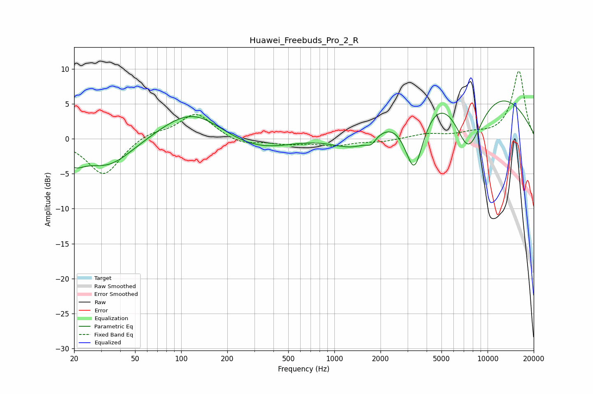

# Huawei_Freebuds_Pro_2_R
See [usage instructions](https://github.com/jaakkopasanen/AutoEq#usage) for more options and info.

### Parametric EQs
Apply preamp of -5.5 dB when using parametric equalizer.

|   # | Type    |   Fc (Hz) |    Q |   Gain (dB) |
|-----|---------|-----------|------|-------------|
|   1 | Peaking |        20 | 2.31 |        -2.1 |
|   2 | Peaking |        34 | 0.82 |        -5   |
|   3 | Peaking |        36 | 0.79 |         0.9 |
|   4 | Peaking |       119 | 0.68 |         4.6 |
|   5 | Peaking |       318 | 0.54 |        -2.7 |
|   6 | Peaking |      1456 | 0.61 |        -9.4 |
|   7 | Peaking |      1738 | 4.81 |        -0.9 |
|   8 | Peaking |      3322 | 1.89 |       -11.8 |
|   9 | Peaking |      4313 | 0.22 |        14.8 |
|  10 | Peaking |      7468 | 1.15 |       -12.2 |

### Fixed Band EQs
When using fixed band (also called graphic) equalizer, apply preamp of **-9.8 dB** (if available) and set gains manually with these parameters.

|   # | Type    |   Fc (Hz) |    Q |   Gain (dB) |
|-----|---------|-----------|------|-------------|
|   1 | Peaking |        31 | 1.41 |        -5.3 |
|   2 | Peaking |        62 | 1.41 |         1   |
|   3 | Peaking |       125 | 1.41 |         3.7 |
|   4 | Peaking |       250 | 1.41 |        -0.9 |
|   5 | Peaking |       500 | 1.41 |        -0.7 |
|   6 | Peaking |      1000 | 1.41 |        -0.9 |
|   7 | Peaking |      2000 | 1.41 |        -0.4 |
|   8 | Peaking |      4000 | 1.41 |         0.6 |
|   9 | Peaking |      8000 | 1.41 |         0.6 |
|  10 | Peaking |     16000 | 1.41 |         9.7 |

### Graphs

