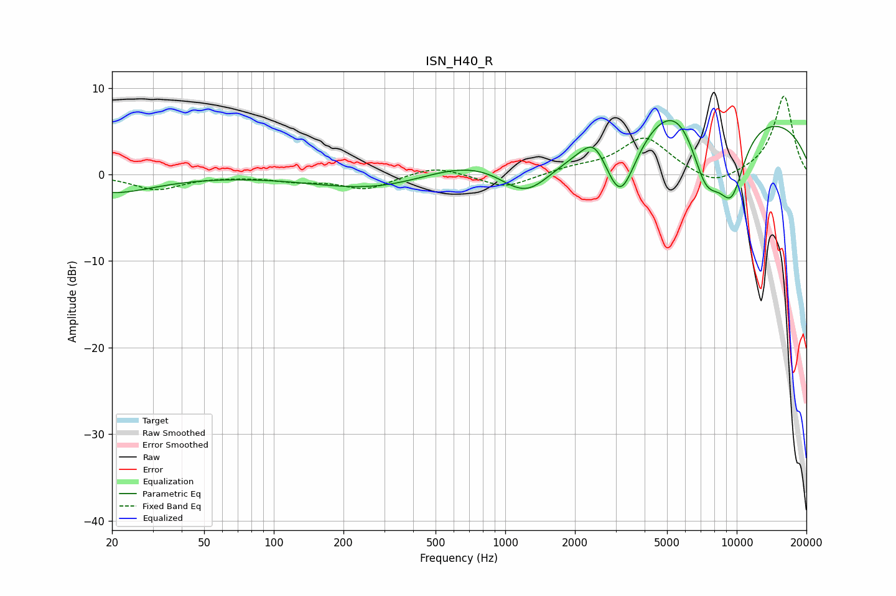

# ISN_H40_R
See [usage instructions](https://github.com/jaakkopasanen/AutoEq#usage) for more options and info.

### Parametric EQs
Apply preamp of -6.3 dB when using parametric equalizer.

|   # | Type    |   Fc (Hz) |    Q |   Gain (dB) |
|-----|---------|-----------|------|-------------|
|   1 | Peaking |        20 | 0.77 |        -2.1 |
|   2 | Peaking |       294 | 0.53 |        -2.1 |
|   3 | Peaking |       801 | 0.54 |         2.6 |
|   4 | Peaking |      1228 | 1.15 |        -5   |
|   5 | Peaking |      2424 | 2.55 |         2.8 |
|   6 | Peaking |      3140 | 1.93 |        -8.4 |
|   7 | Peaking |      5957 | 0.92 |         7.3 |
|   8 | Peaking |      7323 | 1.42 |       -11.5 |
|   9 | Peaking |      9233 | 0.21 |         7.4 |
|  10 | Peaking |      9514 | 2.09 |        -7.1 |

### Fixed Band EQs
When using fixed band (also called graphic) equalizer, apply preamp of **-9.1 dB** (if available) and set gains manually with these parameters.

|   # | Type    |   Fc (Hz) |    Q |   Gain (dB) |
|-----|---------|-----------|------|-------------|
|   1 | Peaking |        31 | 1.41 |        -1.7 |
|   2 | Peaking |        62 | 1.41 |        -0.1 |
|   3 | Peaking |       125 | 1.41 |        -0.6 |
|   4 | Peaking |       250 | 1.41 |        -1.6 |
|   5 | Peaking |       500 | 1.41 |         1.1 |
|   6 | Peaking |      1000 | 1.41 |        -1.6 |
|   7 | Peaking |      2000 | 1.41 |         0.7 |
|   8 | Peaking |      4000 | 1.41 |         4.2 |
|   9 | Peaking |      8000 | 1.41 |        -1.5 |
|  10 | Peaking |     16000 | 1.41 |         9.1 |

### Graphs

