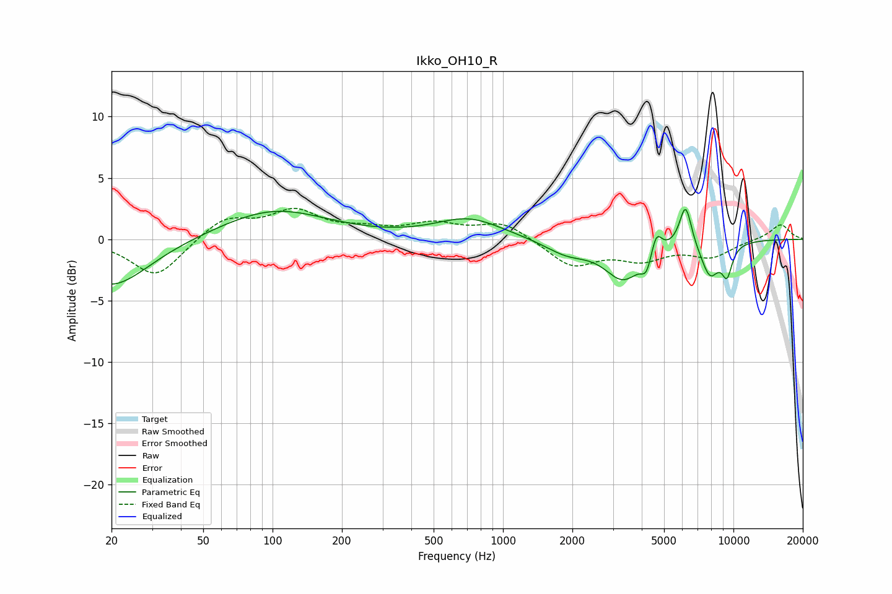

# Ikko_OH10_R
See [usage instructions](https://github.com/jaakkopasanen/AutoEq#usage) for more options and info.

### Parametric EQs
Apply preamp of -2.5 dB when using parametric equalizer.

|   # | Type    |   Fc (Hz) |    Q |   Gain (dB) |
|-----|---------|-----------|------|-------------|
|   1 | Peaking |        20 | 0.87 |        -3.9 |
|   2 | Peaking |       101 | 0.61 |         2.4 |
|   3 | Peaking |       711 | 0.98 |         1.7 |
|   4 | Peaking |      1895 | 1.44 |        -1.1 |
|   5 | Peaking |      3325 | 1.75 |        -3.1 |
|   6 | Peaking |      4201 | 5.98 |        -1.5 |
|   7 | Peaking |      4625 | 6    |         1.9 |
|   8 | Peaking |      6198 | 5.19 |         3.5 |
|   9 | Peaking |      7911 | 3.25 |        -2.8 |
|  10 | Peaking |      9378 | 5.47 |        -2.3 |

### Fixed Band EQs
When using fixed band (also called graphic) equalizer, apply preamp of **-2.6 dB** (if available) and set gains manually with these parameters.

|   # | Type    |   Fc (Hz) |    Q |   Gain (dB) |
|-----|---------|-----------|------|-------------|
|   1 | Peaking |        31 | 1.41 |        -3.1 |
|   2 | Peaking |        62 | 1.41 |         1.8 |
|   3 | Peaking |       125 | 1.41 |         2.1 |
|   4 | Peaking |       250 | 1.41 |         0.6 |
|   5 | Peaking |       500 | 1.41 |         1.1 |
|   6 | Peaking |      1000 | 1.41 |         1.4 |
|   7 | Peaking |      2000 | 1.41 |        -2.2 |
|   8 | Peaking |      4000 | 1.41 |        -1.5 |
|   9 | Peaking |      8000 | 1.41 |        -1.3 |
|  10 | Peaking |     16000 | 1.41 |         1.3 |

### Graphs

