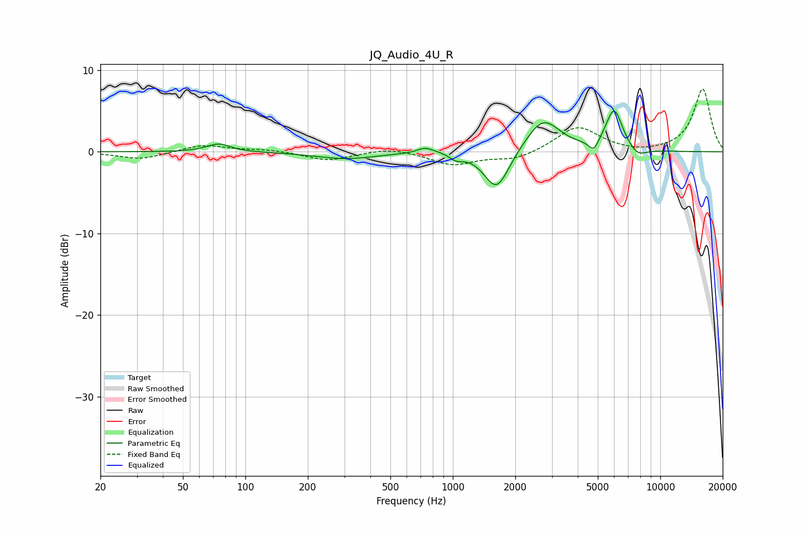

# JQ_Audio_4U_R
See [usage instructions](https://github.com/jaakkopasanen/AutoEq#usage) for more options and info.

### Parametric EQs
Apply preamp of -5.1 dB when using parametric equalizer.

|   # | Type    |   Fc (Hz) |    Q |   Gain (dB) |
|-----|---------|-----------|------|-------------|
|   1 | Peaking |        74 | 2.51 |         1   |
|   2 | Peaking |       306 | 0.98 |        -0.8 |
|   3 | Peaking |       734 | 3.91 |         0.6 |
|   4 | Peaking |       963 | 1.68 |         0.4 |
|   5 | Peaking |      1035 | 3.94 |        -0.9 |
|   6 | Peaking |      1626 | 2.31 |        -5   |
|   7 | Peaking |      2718 | 1.72 |         4.1 |
|   8 | Peaking |      4780 | 6    |        -1.4 |
|   9 | Peaking |      5993 | 3.39 |         5.1 |
|  10 | Peaking |      7780 | 3.08 |        -1.1 |

### Fixed Band EQs
When using fixed band (also called graphic) equalizer, apply preamp of **-7.8 dB** (if available) and set gains manually with these parameters.

|   # | Type    |   Fc (Hz) |    Q |   Gain (dB) |
|-----|---------|-----------|------|-------------|
|   1 | Peaking |        31 | 1.41 |        -0.9 |
|   2 | Peaking |        62 | 1.41 |         0.9 |
|   3 | Peaking |       125 | 1.41 |         0.3 |
|   4 | Peaking |       250 | 1.41 |        -1.1 |
|   5 | Peaking |       500 | 1.41 |         0.6 |
|   6 | Peaking |      1000 | 1.41 |        -1.6 |
|   7 | Peaking |      2000 | 1.41 |        -1   |
|   8 | Peaking |      4000 | 1.41 |         3.1 |
|   9 | Peaking |      8000 | 1.41 |        -0.3 |
|  10 | Peaking |     16000 | 1.41 |         7.7 |

### Graphs

