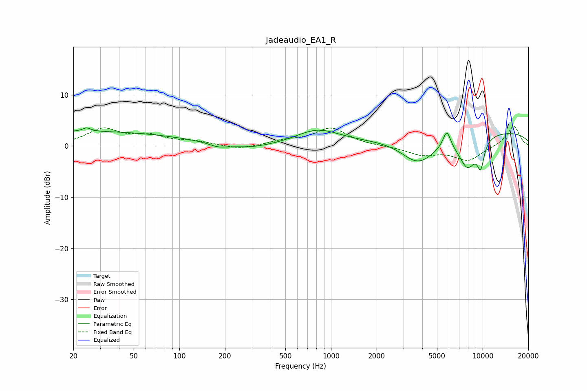

# Jadeaudio_EA1_R
See [usage instructions](https://github.com/jaakkopasanen/AutoEq#usage) for more options and info.

### Parametric EQs
Apply preamp of -3.6 dB when using parametric equalizer.

|   # | Type    |   Fc (Hz) |    Q |   Gain (dB) |
|-----|---------|-----------|------|-------------|
|   1 | Peaking |        24 | 5.39 |         0.7 |
|   2 | Peaking |        25 | 0.21 |         2.8 |
|   3 | Peaking |       179 | 2.6  |        -0.7 |
|   4 | Peaking |       286 | 0.86 |        -0.9 |
|   5 | Peaking |       814 | 0.97 |         3   |
|   6 | Peaking |      3771 | 1.21 |        -5.3 |
|   7 | Peaking |      5804 | 5.33 |         3.6 |
|   8 | Peaking |      7956 | 2.2  |        -6.1 |
|   9 | Peaking |      9585 | 0.18 |         3.1 |
|  10 | Peaking |      9714 | 5.4  |        -4.8 |

### Fixed Band EQs
When using fixed band (also called graphic) equalizer, apply preamp of **-3.9 dB** (if available) and set gains manually with these parameters.

|   # | Type    |   Fc (Hz) |    Q |   Gain (dB) |
|-----|---------|-----------|------|-------------|
|   1 | Peaking |        31 | 1.41 |         3.2 |
|   2 | Peaking |        62 | 1.41 |         1.8 |
|   3 | Peaking |       125 | 1.41 |         0.8 |
|   4 | Peaking |       250 | 1.41 |        -0.8 |
|   5 | Peaking |       500 | 1.41 |         0.9 |
|   6 | Peaking |      1000 | 1.41 |         3.4 |
|   7 | Peaking |      2000 | 1.41 |        -0   |
|   8 | Peaking |      4000 | 1.41 |        -1.6 |
|   9 | Peaking |      8000 | 1.41 |        -2.8 |
|  10 | Peaking |     16000 | 1.41 |         4   |

### Graphs

