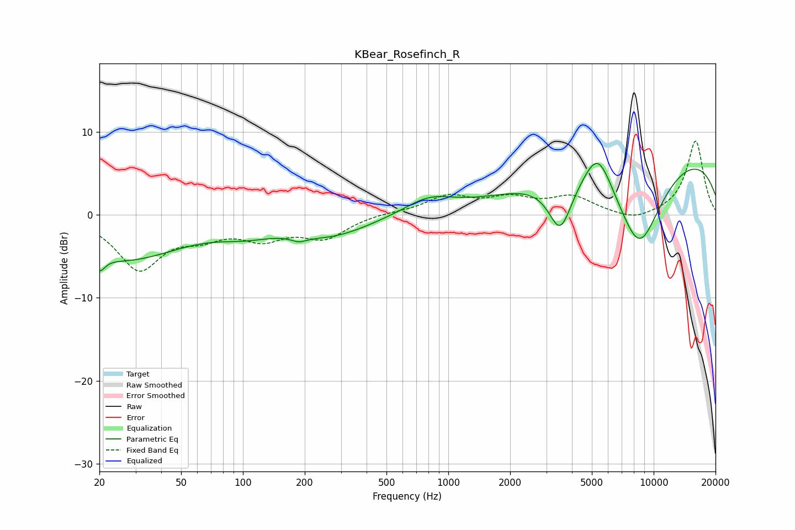

# KBear_Rosefinch_R
See [usage instructions](https://github.com/jaakkopasanen/AutoEq#usage) for more options and info.

### Parametric EQs
Apply preamp of -6.3 dB when using parametric equalizer.

|   # | Type    |   Fc (Hz) |    Q |   Gain (dB) |
|-----|---------|-----------|------|-------------|
|   1 | Peaking |        20 | 5.4  |        -1.8 |
|   2 | Peaking |        26 | 0.5  |        -5.2 |
|   3 | Peaking |       104 | 1.01 |        -1.3 |
|   4 | Peaking |       187 | 3.67 |        -0.6 |
|   5 | Peaking |       269 | 0.73 |        -2.4 |
|   6 | Peaking |       803 | 1.19 |         1.9 |
|   7 | Peaking |      3510 | 2.44 |        -6.2 |
|   8 | Peaking |      5355 | 2.04 |         4.8 |
|   9 | Peaking |      8480 | 1.04 |       -11.7 |
|  10 | Peaking |     10000 | 0.21 |         8.4 |

### Fixed Band EQs
When using fixed band (also called graphic) equalizer, apply preamp of **-9.0 dB** (if available) and set gains manually with these parameters.

|   # | Type    |   Fc (Hz) |    Q |   Gain (dB) |
|-----|---------|-----------|------|-------------|
|   1 | Peaking |        31 | 1.41 |        -6.3 |
|   2 | Peaking |        62 | 1.41 |        -1.9 |
|   3 | Peaking |       125 | 1.41 |        -2.5 |
|   4 | Peaking |       250 | 1.41 |        -2.6 |
|   5 | Peaking |       500 | 1.41 |         0.3 |
|   6 | Peaking |      1000 | 1.41 |         2.1 |
|   7 | Peaking |      2000 | 1.41 |         1.7 |
|   8 | Peaking |      4000 | 1.41 |         2   |
|   9 | Peaking |      8000 | 1.41 |        -0.9 |
|  10 | Peaking |     16000 | 1.41 |         9   |

### Graphs

