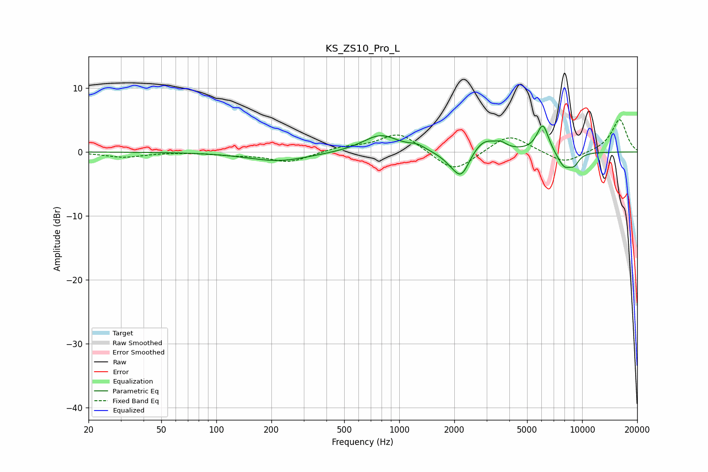

# KS_ZS10_Pro_L
See [usage instructions](https://github.com/jaakkopasanen/AutoEq#usage) for more options and info.

### Parametric EQs
Apply preamp of -4.1 dB when using parametric equalizer.

|   # | Type    |   Fc (Hz) |    Q |   Gain (dB) |
|-----|---------|-----------|------|-------------|
|   1 | Peaking |       219 | 0.85 |        -1.4 |
|   2 | Peaking |       791 | 1.44 |         2.7 |
|   3 | Peaking |      1253 | 3.36 |         0.7 |
|   4 | Peaking |      1949 | 2.38 |        -1.2 |
|   5 | Peaking |      2192 | 3.12 |        -3.7 |
|   6 | Peaking |      2900 | 2.01 |         2.3 |
|   7 | Peaking |      3599 | 4.98 |         0.7 |
|   8 | Peaking |      6098 | 4.19 |         4.5 |
|   9 | Peaking |      8005 | 3.16 |        -2.5 |
|  10 | Peaking |      9077 | 4.97 |        -1.3 |

### Fixed Band EQs
When using fixed band (also called graphic) equalizer, apply preamp of **-5.2 dB** (if available) and set gains manually with these parameters.

|   # | Type    |   Fc (Hz) |    Q |   Gain (dB) |
|-----|---------|-----------|------|-------------|
|   1 | Peaking |        31 | 1.41 |        -0.8 |
|   2 | Peaking |        62 | 1.41 |         0   |
|   3 | Peaking |       125 | 1.41 |        -0.4 |
|   4 | Peaking |       250 | 1.41 |        -1.6 |
|   5 | Peaking |       500 | 1.41 |         0.7 |
|   6 | Peaking |      1000 | 1.41 |         3.1 |
|   7 | Peaking |      2000 | 1.41 |        -3.4 |
|   8 | Peaking |      4000 | 1.41 |         2.9 |
|   9 | Peaking |      8000 | 1.41 |        -1.9 |
|  10 | Peaking |     16000 | 1.41 |         5.2 |

### Graphs

