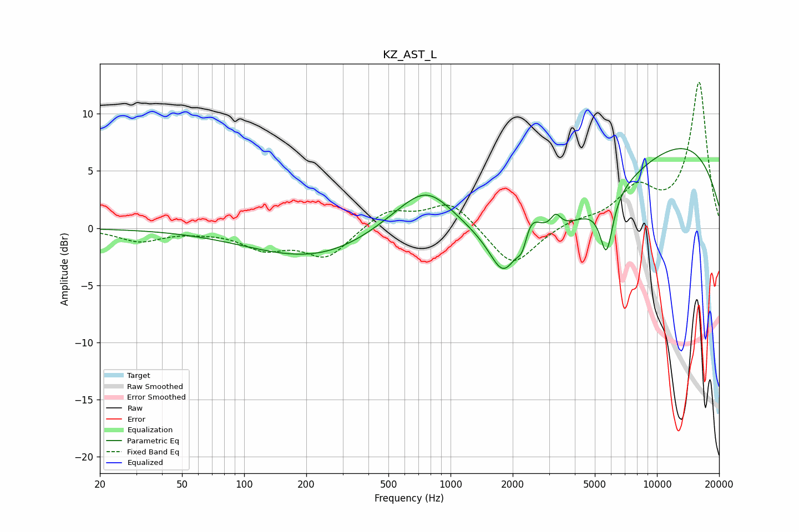

# KZ_AST_L
See [usage instructions](https://github.com/jaakkopasanen/AutoEq#usage) for more options and info.

### Parametric EQs
Apply preamp of -7.1 dB when using parametric equalizer.

|   # | Type    |   Fc (Hz) |    Q |   Gain (dB) |
|-----|---------|-----------|------|-------------|
|   1 | Peaking |       332 | 0.35 |        -4.3 |
|   2 | Peaking |       718 | 0.49 |         5.9 |
|   3 | Peaking |       766 | 1.24 |         2.1 |
|   4 | Peaking |      1807 | 2.22 |        -3.5 |
|   5 | Peaking |      2234 | 5.12 |        -2.3 |
|   6 | Peaking |      2386 | 2.79 |         3.3 |
|   7 | Peaking |      3137 | 0.31 |        -7.6 |
|   8 | Peaking |      3233 | 5.96 |         1.2 |
|   9 | Peaking |      5692 | 4.43 |        -4.9 |
|  10 | Peaking |      8868 | 0.23 |         9.8 |

### Fixed Band EQs
When using fixed band (also called graphic) equalizer, apply preamp of **-12.9 dB** (if available) and set gains manually with these parameters.

|   # | Type    |   Fc (Hz) |    Q |   Gain (dB) |
|-----|---------|-----------|------|-------------|
|   1 | Peaking |        31 | 1.41 |        -1.1 |
|   2 | Peaking |        62 | 1.41 |        -0.1 |
|   3 | Peaking |       125 | 1.41 |        -1.6 |
|   4 | Peaking |       250 | 1.41 |        -2.5 |
|   5 | Peaking |       500 | 1.41 |         1.6 |
|   6 | Peaking |      1000 | 1.41 |         2.3 |
|   7 | Peaking |      2000 | 1.41 |        -3.5 |
|   8 | Peaking |      4000 | 1.41 |         0.6 |
|   9 | Peaking |      8000 | 1.41 |         3.2 |
|  10 | Peaking |     16000 | 1.41 |        12.7 |

### Graphs

